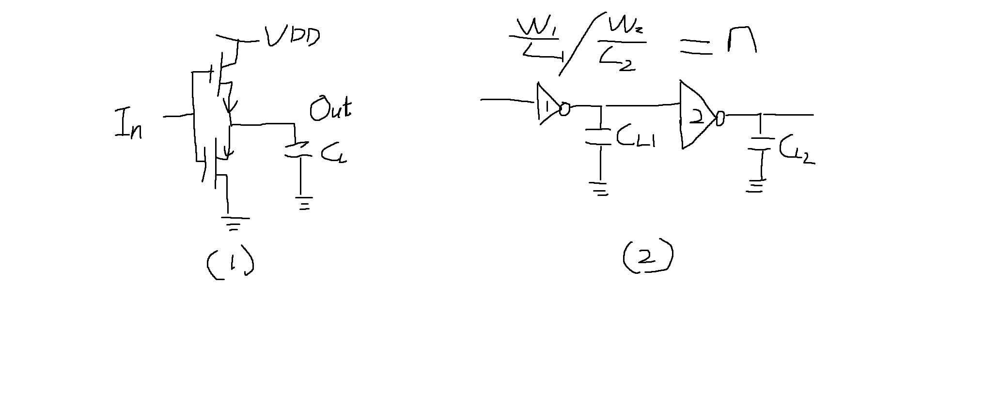
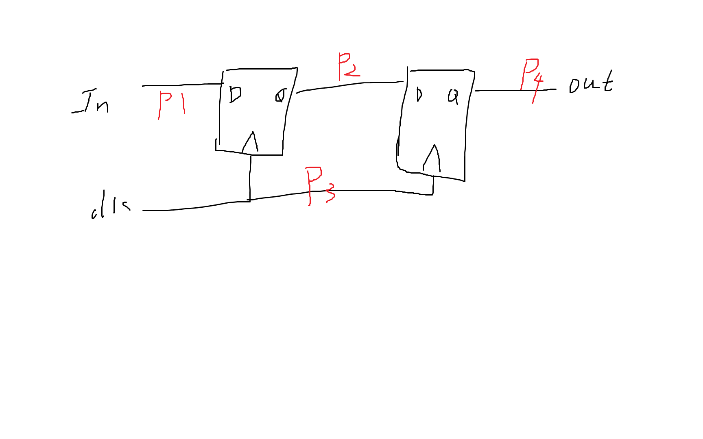

# 
高等数字集成电路作业-2022-09-30  
  

Author: 文家宝
  

## 1. 基础概念问题
 

1.  请简要描述集成电路设计过程中，抽象分层的常规做法？抽象分层对集成电路设计所带来的意义何在?  
答：

    > 常规分层方法  
    > 1. 系统层:  一般利用各种IP（如：PLL，AXI, CPU）或者（ALU, FIFO）构成更复杂的电路
    > 2. 模块层级:   一般利用由基本逻辑单元构成的各项电路（如：DFF，MUX）构成复杂程度更高的电路
    > 3. 门电路层级: 一般利用工艺厂商提供的std(stander cell)去设计由基本逻辑单元构成的电路
    > 4. 电路层级:   一般利用工艺厂商提供的*pdk*文件去在*circuit*层面去设计标准功能单元
    > 5. 器件级:     一般具体到用什么工艺,去设计*FET/Transistor*。

     

    抽象分层对集成电路设计所带来的意义：能够设计规模越大、性能越高、设计越复杂的电路.  

2.  请简要描述为何典型的超大规模集成电路，通常是采用CMOS工艺为基础进行的设计，而不是采用基于其他工艺为基础进行VLSI设计?

    答：
    - **无电荷损失**，对比nmos的上拉电阻造成的电压降低。CMOS由于其导通电阻很小故可看做其输出端无电压损失
    - **静态功耗小**，对比单个mos做的导向器来说，cmos结构的两个管子只工作在截至区和深度线性区，此处IDS约等于0。
    - **更易集成**，由于芯片仅有mos结构，故在制造时晶体管密度更高，面积更小成本更低。
  
 

3. 请通过查阅文献，介绍MOS器件、NMOS器件、PMOS器件、CMOS器件、CMOS集成电路的发明历史、发明人、对行业发展带来的促进意义，CMOS技术发展演进的若干行业标志性事件。  
    答：  
    
    | 
器件
  | 
发明人
  |  
历史
 | 
历史意义
  |   
    |---|---|---|---|
    |  MOS | Shcokley  |  1960 | 发明表面钝化的这项技术成为硅集成电路发展史上的里程碑  |   
    | PMOS  | 
/  
  |  
/  
 | PMOS是指n型衬底、p沟道，靠空穴的流动运送电流的MOS管。  |   
    |  NMOS | 
/  
  | 
/  
  |  NMOS以电子为载流子，速度快，开发NMOS工艺，提升开关响应速度。 |   
    |  CMOS | Frank.M.Wanlass/萨支唐  | 1963  |  此后开始进入摩尔时代从上世纪70—80年代开始，就逐步成为了集成电路芯片生产的主流工艺，这一技术，直到今天，仍牢牢占据了全球半导体集成电路芯片产业95%以上的工艺制程。 |   

     

4.  请分析针对CMOS反相器电路设计优化，在输出驱动一定的前提下，通过哪些技术手段可提高CMOS反相器的驱动能力？

    答：可以利用多级反相器级联方式提高反相器驱动能力。反相器通过PMOS和NMOS对负载电容充放电完成工作，如果一个反相器尺寸系数是另一个的n倍，那么对应的电流也是n倍，对电容充放电速度也是n倍。对应一个比较大的负载电容，假设这个电容远大于反相器的输入电容，那么采用右图反相器，相当于可以忽略第一级延时，直接用第二级大电流对电容充电。实际情况复杂点，增大第二级反相器尺寸会减小第二级延时，增加第一级延时，这是因为由于第二级负载过大使得第一级充电的输出电容变大，充电时间加长。

    

 

 

5.  请简要描述在CMOS电路设计过程中，如何避免或降低寄生电感引起的同步开关噪声（SSN）所导致的电路性能不稳定？

    答：
    同步开关噪声Simultaneous Switch Noise，简称为SSN，代表的意思为大量的芯片同步切换时产生的瞬态电流在电源或地平面上产生的大量噪声现象。这是电源分布网络(PDN)中delta-I噪声、返回电流共享I/O网络中的共同路径、发射噪声和耦合噪声的组合影响。除了增加噪声外，信号电平和电源电压可能继续降低。如果不进行控制，SSN可能导致逻辑电路错误地切换状态或者导致电路延时增加。同步开关噪声对电源完整性产生的影响主要表现为地/电源(Ground Bounce/Power Bounce)反弹现象。  
    **减小SSN的方法**  
    - 减小信号的电源和地平面的阻抗  
    - 减小电源和地的回路电感  
    - 合理分配芯片的信号、电源和地引脚的数量比值  
    - 在芯片电源和地引脚附件添加合理的去耦电容 

  
 

6. 请说明为何在绝大部分VLSI电路设计过程中，都使用的同步电路而非异步电路，同步电路与异步电路各自优劣势。  
    答:  
同步电路：其核心逻辑用触发器实现，电路的主要信号、输出信号都由某个时钟沿驱动产生。可以很好的避免毛刺，有利于STA（静态时序分析）、验证设计时序性能。  
异步电路：其核心逻辑使用组合电路实现，电路的主要信号、输出信号不依赖于任何一个时钟信号。容易产生毛刺，不利于器件移植，不利于STA、验证设计时序性能。

7.  请简要描述ASIC/FPGA前端设计流程？简要描述Top-Down设计流程的意义及挑战？

    答： 

    > 1. 硬件设计定义：确定总体架构，模块划分，使用的总线等
    > 2. 模块设计及IP使用: RTL设计
    > 3. 顶层模块集成： 如SOC的胶合逻辑，系统时钟集成，IO环等。
    > 4. 前仿真： 验证HDL电路功能是否有效
    > 5. 逻辑综合：将RTL通过编译产生符合约束条件的网表/比特流文件,并做第一次STA（共做3次）

     Top-Down设计流程的意义：可以优化设计流程、提高设计效率，并确保工程设计整体的关联性,但他的挑战在于需要制定清楚各个流程间的边界条件；需要在特定边界条件的约束下完成对特定任务的高效收敛设计
  
 

8. 请简要说明在基于标准单元库进行ASIC设计的流程中，静态时序分析（Static Timing Analysis）的作用是什么，主要分析内容是什么。  
答：  
静态时序分析的作用是判断电路在当前时序路径约束下是否存在时序违例。
> 在EDA设计流程中第一次STA处于电路经过综合工具综合成网表阶段后去判断电路基于标准单元库的延迟信息是否出现时序违例。  
> 第二次是在电路经过布局布线后加上真实的布线延迟以及电源网络的影响去判断是否有时序违例。  
*ps:（至于为什么在电路综合和布局布线时已经写SDC时序约束后还要在专门进行STA分析，是因为首先在测算精度上，专门的STA分析工具如PT更加精确，  
以往时序的验证依赖于仿真，采用仿真的方法，覆盖率跟所施加的激励有关，有些时序违例会被忽略。此外，仿真方法效率非常的低，会大大延长产品的开发周期。静态时序分析工具很好地解决了这两个问题。它不需要激励向量，可以报出芯片中所有的时序违例，并且速度很快。  
同时对于全芯片的约束也只有专门的STA工具能够完成，同时对于STA使用的次数一般而言在工程上在除每次改动RTL以及布局布线布电源时钟网络后需要重新跑，同时在芯片交付前ECO阶段每次ECO后也要进行STA去判断时序伪例。）*
   

**STA主要分析的内容包括**  
首先STA工具读入综合后的网表信息文件，以及时序约束（SDC）信息，通过以下三个步骤进行STA分析以下图为例次电路被分解为4条子时序路径。  

1. 将整个电路分解为时序路径，以输出为起点输出为终点，其中每个子时序路径只能包括经过一个寄存器。
2. 计算连线延迟、组合逻辑延迟、工艺角，寄存器clk到寄存器输出Q的延迟
3. 检查路径时序约束是否满足。路径约束主要指的是建立时间约束和保持时间约束。
    - 建立时间 ：采样时钟到达之前，数据应该稳定的时间
    - 保持时间 ：在时钟到达之后，数据应该保持的时间
    - 纯组合逻辑：检查最大延时约束和最小延时路径。
    - 计算时钟偏斜（skew）,时钟抖动（jitter）

9.  请结合所在课题组研究课题方向，对如何学好本课程内容并结合课程内容更好的开展研发工作进行简要论述。 

    答：本人研究课题方向为面向龙芯的超标量处理器设计，由于处理器设计再大的范畴属于数字集成电路设计，所以通过本门课程我将更为细致的了解从系统级别的角度去看待处理器设计，如何增加流水，如何提升运算单元的运算速度，如何将逻辑分层解耦。此门课程是实践性很强的课程，我认为想要学好此门课程不应只局限于书本，要勤实践多编码。同时在动手前要运用TopDown的思路去整体规划整个设计。