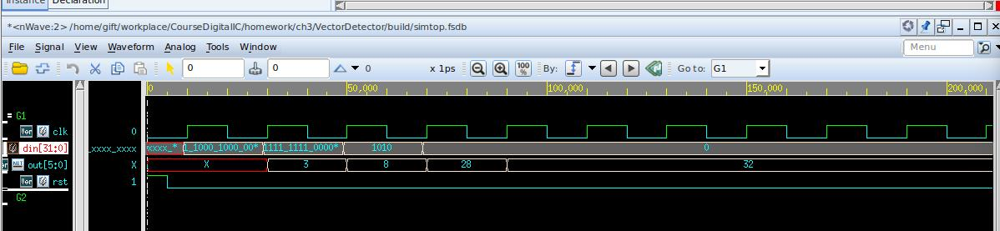
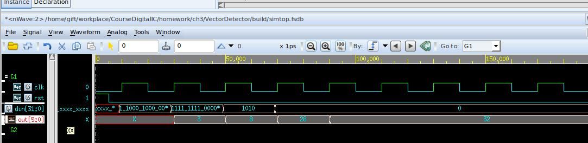
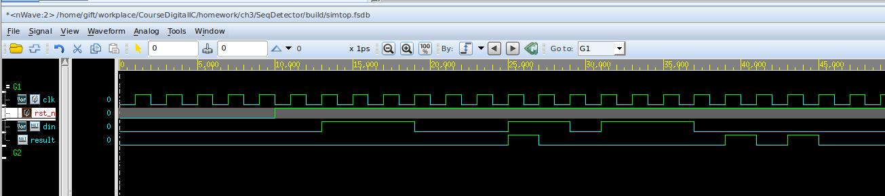
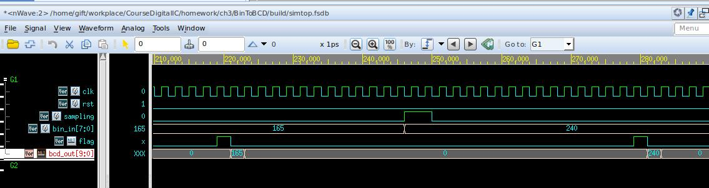
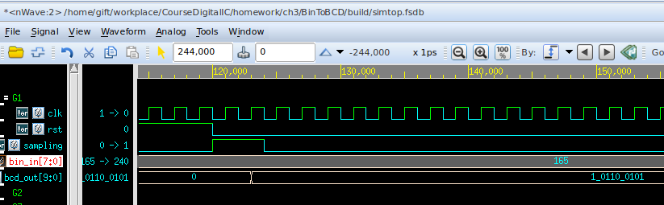
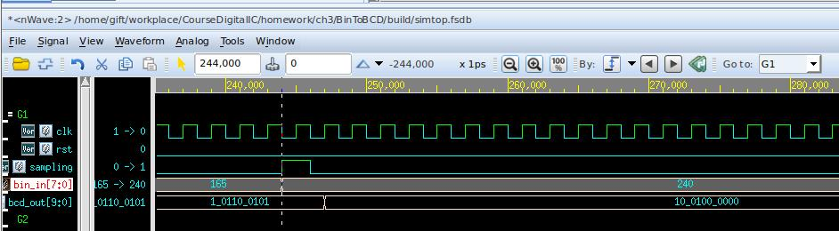

<!--
 * @Author: WenJiaBao-2022E8020282071
 * @Date: 2022-10-04 12:53:02
 * @LastEditTime: 2022-10-04 15:55:22
 * @Description: 高等数字集成电路作业-2022-10-06
 * 
 * Copyright (c) 2022 by WenJiaBao wenjiabao0919@163.com, All Rights Reserved. 
-->
# <p align="middle">高等数字集成电路作业-第三章  </p>  
<p align="right">Author: 文家宝</p>  

## 1. 基础概念问题
<br>

1. 请简要描述基于VerilogHDL语言对VLSI/FPGA设计带来的意义？  
    
    VerilogHDL语言以文本形式描述数字系统硬件结构行为，是一种用形式化方法来描述数字电路和系统的语言。在进行VLSI/FPGA设计的时候，可以自上而下的逐层描述自己的设计思想。可以把具体的模块组合并通过综合工具转化为门级网表，大大简化了VLSI/FPGA设计难度。  
2. 请简要描述基于VerilogHDL语言完成的可综合电路与不可综合电路的特点？  

    可综合电路：是指VerilogHDL语言可以在标准单元库和特定的约束标准基础上，把设计的高层次描述转化成优化的门级网表。
    不可综合电路：VerilogHDL语言中不可以被综合成实际的硬件电路的语句。例如一些用于仿真验证的关键字，属于仿真验证语言，只能在仿真时使用，不能被综合成电路，如系统任务 `$dsiplay, initial` 语句等。
3. 请简要描述阻塞描述语句与非阻塞描述语句的各自适用电路与使用注意事项？  
    
    **阻塞赋值**: 语句的串⾏执⾏，前⾯语句执⾏完，才可执⾏下⼀条语句，当前赋值语句正在执⾏时禁⽌其后的所有其他赋值语句的执⾏。适⽤于组合逻辑电路结构的设计，在描述组合逻辑的always块中使⽤阻塞赋值，会将电路综合成组合逻辑的电路结构。  
    **⾮阻塞赋值**: 语句的并⾏执⾏，时钟沿到来时，always模块中的赋值同时进⾏，不存在先后顺序，前⾯语句的执⾏，不会阻塞后⾯语句的执⾏。适⽤于时序逻辑电路结构的设计，在描述时序逻辑的always块中使⽤⾮阻塞赋值，会将电路综合成时序逻辑的电路结构。  
    **注意事项** :  
    ①避免在通过⼀个always块中既⽤⾮阻塞赋值⼜⽤阻塞赋值。  
    ②不要在不同的的always块中为同⼀个变量赋值。  
    ③在赋值时不要使⽤延迟语句。  
4. 请简要分析全同步电路与异步电路在常规VLSI电路设计过程中的设计应用注意事项与考虑思路？  
    **同步电路**：由时序电路和组合逻辑电路构成的电路，其所有操作都是在严格的时钟控制下完成的。这些时序电路共享同⼀个时钟CLK，⽽所有的状态变化都是在时钟的上升沿（或下降沿）完成的。  
    **异步电路**：核⼼逻辑使⽤组合电路实现，电路的主要信号、输出信号不依赖于任何⼀个时钟信号。  
    **注意事项和考虑思路**：  
    ①异步电路设计时必须要考虑跨时钟域可能会导致的亚稳态问题，最简单的可以采⽤两级D触发器来实现跨时
    钟域处理。  
    ②异步电路容易产⽣竞争冒险，应尽量采⽤同步电路来有效避免⽑刺的影响，提⾼设计可靠性，并可以简化静态时序分析过程，便于验证时序性能。  
    ③全同步电路所有的触发器状态同时刷新，信号延迟时间短，但结构复杂。异步电路结构简单，但触发器刷新不同步，信号延迟可能会累积导致状态异常。  
5. 请简要分析Latch与D-Flip-Flop电路在常规VLSI电路设计过程中的设计应用注意事项与考虑思路？  
    **Latch**：是电平触发的存储单元，数据存储的动作取决于输⼊时钟（或者使能）信号的电平值。锁存器在数据未锁存时，输出端的信号随输⼊信号变化，充当⼀个缓冲器，⼀旦锁存信号有效，则数据被锁存，输⼊信号不起作⽤。可以⽤于解决⾼速的控制器与慢速的外设的不同步问题和驱动能⼒问题。D-Flip-Flop：是边沿敏感的存储单元，数据的存储由某⼀信号（⼀般为时钟信号）的上升沿或者下降沿进⾏。可存储1bit的数据，是register的基本组成单位。  
    **注意事项和考虑思路**：  
    ①锁存器Latch对⽑刺敏感，不能异步复位，所以上电以后处于不确定的状态。    
    ②锁存器Latch会增加静态时序分析的复杂度。  
    ③⽣成锁存器需要更多的FPGA资源（查找表和触发器）。 ⼀般设计时应注意代码规范，如case语句中需对未声明的case进⾏default处理。避免产⽣Latch。   

## 2. 基于VerilogHDL进行逻辑电路设计
<br>

### 1. **向量前导1检测器**  
设计一个组合逻辑电路，检测输入32位0/1向量中从高到低第一个1出现的位置，如果向量为全0则输出32。例如：   
输入00011000 10000000 00000000 00000000，输出3；   
输入00000000 11111111 00000000 00000000，输出8；  
输入00000000 00000000 00000000 00001010，输出28.  

模块输入输出功能定义：       

| <p align="middle">名称</p>  | <p align="middle">方向</p>  |  <p align="middle">位宽</p> | <p align="middle">描述</p>  |   
|---|---|---|---|
|  <p align="middle">data_in  </p> | <p align="middle">Input  </p>  |  <p align="middle">32  </p> | <p align="middle">输入0/1向量  </p>  |  
|  <p align="middle">pos_out  </p> | <p align="middle">Output  </p>  |  <p align="middle">6  </p> | <p align="middle">前导1出现位置，取值范围0 ~ 32  </p>  |  
|

**实现思路一：纯MUX多选**
```verilog
assign pos_out =    data_in[31] ? 6'd0 : 
                    data_in[30] ? 6'd1 : 
                    data_in[29] ? 6'd2 : 
                    data_in[28] ? 6'd3 : 
                    data_in[27] ? 6'd4 : 
                    data_in[26] ? 6'd5 : 
                    data_in[25] ? 6'd6 : 
                    data_in[24] ? 6'd7 : 
                    data_in[23] ? 6'd8 : 
                    data_in[22] ? 6'd9 : 
                    data_in[21] ? 6'd10 : 
                    data_in[20] ? 6'd11 : 
                    data_in[19] ? 6'd12 : 
                    data_in[18] ? 6'd13 : 
                    data_in[17] ? 6'd14 : 
                    data_in[16] ? 6'd15 : 
                    data_in[15] ? 6'd16 : 
                    data_in[14] ? 6'd17 : 
                    data_in[13] ? 6'd18 : 
                    data_in[12] ? 6'd19 : 
                    data_in[11] ? 6'd20 : 
                    data_in[10] ? 6'd21 : 
                    data_in[9]  ? 6'd22 : 
                    data_in[8]  ? 6'd23 : 
                    data_in[7]  ? 6'd24 : 
                    data_in[6]  ? 6'd25 : 
                    data_in[5]  ? 6'd26 : 
                    data_in[4]  ? 6'd27 : 
                    data_in[3]  ? 6'd28 : 
                    data_in[2]  ? 6'd29 : 
                    data_in[1]  ? 6'd30 : 
                    data_in[0]  ? 6'd31 :
                                  6'd32 ;
```
仿真截图：  
  

逻辑综合：     
采用smic180nm工艺库PVT环境为SS工艺角进行综合，时钟最高频率为434Mhz，采用最小面积约束进行综合
```
#==================================Env Vars===================================
set RST_NAME				rst
set CLK_NAME				clk

set CLK_PERIOD_I			2.3
set CLK_PERIOD            	[expr $CLK_PERIOD_I*0.95]
set CLK_SKEW              	[expr $CLK_PERIOD*0.05]
set CLK_SOURCE_LATENCY   	[expr $CLK_PERIOD*0.1]    
set CLK_NETWORK_LATENCY   	[expr $CLK_PERIOD*0.1]  
set CLK_TRAN             	[expr $CLK_PERIOD*0.01]

set INPUT_DELAY_MAX         [expr $CLK_PERIOD*0.4]
set INPUT_DELAY_MIN           0
set OUTPUT_DELAY_MAX        [expr $CLK_PERIOD*0.4]
set OUTPUT_DELAY_MIN          0

set MAX_FANOUT             6
set MAX_TRAN               5
set MAX_CAP                1.5

set ALL_INPUT_EX_CLK [remove_from_collection [all_inputs] [get_ports $CLK_NAME]]
#==================================Define Design Environment=========================
#GUIDANCE: use the default
set_max_area 0

  Point                                                   Incr       Path
  --------------------------------------------------------------------------
  clock clk (rise edge)                                   0.00       0.00
  clock network delay (ideal)                             0.44       0.44
  data_in_r_reg_25_/CK (DFFTRX4M)                         0.00       0.44 r
  data_in_r_reg_25_/Q (DFFTRX4M)                          0.47       0.91 r
  VectorDetector_m1_u0/data_in[25] (VectorDetector_m1)
                                                          0.00       0.91 r
  VectorDetector_m1_u0/U106/Y (INVX8M)                    0.06       0.97 f
  VectorDetector_m1_u0/U81/Y (NAND4X12M)                  0.10       1.07 r
  VectorDetector_m1_u0/U27/Y (NOR2X8M)                    0.06       1.12 f
  VectorDetector_m1_u0/U96/Y (NAND3X8M)                   0.09       1.22 r
  VectorDetector_m1_u0/U74/Y (INVX5M)                     0.06       1.27 f
  VectorDetector_m1_u0/U77/Y (NAND2X8M)                   0.08       1.36 r
  VectorDetector_m1_u0/U86/Y (NOR2X12M)                   0.06       1.42 f
  VectorDetector_m1_u0/U30/Y (CLKNAND2X4M)                0.08       1.50 r
  VectorDetector_m1_u0/U128/Y (OAI2B11X4M)                0.14       1.63 f
  VectorDetector_m1_u0/U145/Y (NOR2X4M)                   0.15       1.78 r
  VectorDetector_m1_u0/U88/Y (NAND2X4M)                   0.09       1.87 f
  VectorDetector_m1_u0/U144/Y (NOR3BX4M)                  0.18       2.05 r
  VectorDetector_m1_u0/U87/Y (NAND2X2M)                   0.08       2.13 f
  VectorDetector_m1_u0/pos_out[1] (VectorDetector_m1)     0.00       2.13 f
  pos_out_reg_1_/RN (DFFTRX4M)                            0.00       2.13 f
  data arrival time                                                  2.13

  clock clk (rise edge)                                   2.18       2.18
  clock network delay (ideal)                             0.44       2.62
  clock uncertainty                                      -0.11       2.51
  pos_out_reg_1_/CK (DFFTRX4M)                            0.00       2.51 r
  library setup time                                     -0.39       2.13
  data required time                                                 2.13
  --------------------------------------------------------------------------
  data required time                                                 2.13
  data arrival time                                                 -2.13
  --------------------------------------------------------------------------
  slack (VIOLATED: increase significant digits)                      0.00

                 Internal         Switching           Leakage            Total
Power Group      Power            Power               Power              Power   (   %    )  Attrs
--------------------------------------------------------------------------------------------------
io_pad             0.0000            0.0000            0.0000            0.0000  (   0.00%)
memory             0.0000            0.0000            0.0000            0.0000  (   0.00%)
black_box          0.0000            0.0000            0.0000            0.0000  (   0.00%)
clock_network      0.0000            0.0000            0.0000            0.0000  (   0.00%)
register           1.9678        5.4038e-02        1.0521e+05            2.0219  (  90.41%)
sequential         0.0000            0.0000            0.0000            0.0000  (   0.00%)
combinational      0.1057            0.1087        1.4091e+05            0.2145  (   9.59%)
--------------------------------------------------------------------------------------------------
Total              2.0735 mW         0.1628 mW     2.4613e+05 pW         2.2365 mW


Reference          Library       Unit Area   Count    Total Area   Attributes
-----------------------------------------------------------------------------
CLKINVX6M          ss_1v62_125c
                                 10.976000       1     10.976000  
DFFTRX1M           ss_1v62_125c
                                 48.294399      11    531.238392  n
DFFTRX4M           ss_1v62_125c
                                 65.856003      27   1778.112076  n
INVX2M             ss_1v62_125c
                                  6.585600       1      6.585600  
INVX4M             ss_1v62_125c
                                  8.780800       9     79.027199  
INVXLM             ss_1v62_125c
                                  6.585600       1      6.585600  
VectorDetector_m1              2100.806366       1   2100.806366  h
-----------------------------------------------------------------------------
Total 7 references                                   4513.331232


```


**实现思路二：二分法查找** 
```verilog
assign pos_out = ( |data_in ) ? pos_out_w   : 5'd32;
assign pos_out_w  =   ( |data_in[31:16] ) ?    pos_out1    :  pos_out2;

assign pos_out1  =   ( |data_in[31:24] ) ?    pos_out1_1    :  pos_out1_2;
assign pos_out2  =   ( |data_in[15:8] ) ?    pos_out2_1    :  pos_out2_2;

assign pos_out1_1  =   ( |data_in[31:28] ) ?    pos_out1_1_1    :  pos_out1_1_2;
assign pos_out1_2  =   ( |data_in[23:20] ) ?    pos_out1_2_1    :  pos_out1_2_2;
assign pos_out2_1  =   ( |data_in[15:12] ) ?    pos_out2_1_1    :  pos_out2_1_2;
assign pos_out2_2  =   ( |data_in[7:4] ) ?    pos_out2_2_1    :  pos_out2_2_2;

assign pos_out1_1_1  =   ( |data_in[31:30] ) ?    pos_out1_1_1_1    :  pos_out1_1_1_2;
assign pos_out1_1_2  =   ( |data_in[27:26] ) ?    pos_out1_1_2_1    :  pos_out1_1_2_2;
assign pos_out1_2_1  =   ( |data_in[23:22] ) ?    pos_out1_2_1_1    :  pos_out1_2_1_2;
assign pos_out1_2_2  =   ( |data_in[19:18] ) ?    pos_out1_2_2_1    :  pos_out1_2_2_2;
assign pos_out2_1_1  =   ( |data_in[15:14] ) ?    pos_out2_1_1_1    :  pos_out2_1_1_2;
assign pos_out2_1_2  =   ( |data_in[11:8] ) ?    pos_out2_1_2_1    :  pos_out2_1_2_2;
assign pos_out2_2_1  =   ( |data_in[7:6] ) ?    pos_out2_2_1_1    :  pos_out2_2_1_2;
assign pos_out2_2_2  =   ( |data_in[3:2] ) ?    pos_out2_2_2_1    :  pos_out2_2_2_2;

assign pos_out1_1_1_1  =   ( data_in[31] ) ?    5'd0    :  5'd1;
assign pos_out1_1_1_2  =   ( data_in[29] ) ?    5'd2    :  5'd3;
assign pos_out1_1_2_1  =   ( data_in[27] ) ?    5'd4    :  5'd5;
assign pos_out1_1_2_1  =   ( data_in[25] ) ?    5'd6    :  5'd7;
assign pos_out1_2_1_1  =   ( data_in[23] ) ?    5'd8    :  5'd9;
assign pos_out1_2_1_2  =   ( data_in[21] ) ?    5'd10    :  5'd11;
assign pos_out1_2_2_1  =   ( data_in[19] ) ?    5'd12    :  5'd13;
assign pos_out1_2_2_2  =   ( data_in[17] ) ?    5'd14    :  5'd15;
assign pos_out2_1_1_1  =   ( data_in[15] ) ?    5'd16    :  5'd17;
assign pos_out2_1_1_2  =   ( data_in[13] ) ?    5'd18    :  5'd19;
assign pos_out2_1_2_1  =   ( data_in[11] ) ?    5'd20    :  5'd21;
assign pos_out2_1_2_1  =   ( data_in[9] ) ?    5'd22   :  5'd23;
assign pos_out2_2_1_1  =   ( data_in[7] ) ?    5'd24    :  5'd25;
assign pos_out2_2_1_2  =   ( data_in[5] ) ?    5'd26    :  5'd27;
assign pos_out2_2_2_1  =   ( data_in[3] ) ?    5'd28    :  5'd29;
assign pos_out2_2_2_2  =   ( data_in[1] ) ?    5'd30    :  5'd31;
```
仿真截图：  
   

逻辑综合：     
采用smic180nm工艺库PVT环境为SS工艺角进行综合，时钟最高频率为588Mhz，采用最小面积约束进行综合
```

#==================================Env Vars===================================
set RST_NAME				rst
set CLK_NAME				clk

set CLK_PERIOD_I			1.7
set CLK_PERIOD            	[expr $CLK_PERIOD_I*0.95]
set CLK_SKEW              	[expr $CLK_PERIOD*0.05]
set CLK_SOURCE_LATENCY   	[expr $CLK_PERIOD*0.1]    
set CLK_NETWORK_LATENCY   	[expr $CLK_PERIOD*0.1]  
set CLK_TRAN             	[expr $CLK_PERIOD*0.01]

set INPUT_DELAY_MAX         [expr $CLK_PERIOD*0.4]
set INPUT_DELAY_MIN           0
set OUTPUT_DELAY_MAX        [expr $CLK_PERIOD*0.4]
set OUTPUT_DELAY_MIN          0

set MAX_FANOUT             6
set MAX_TRAN               5
set MAX_CAP                1.5

set ALL_INPUT_EX_CLK [remove_from_collection [all_inputs] [get_ports $CLK_NAME]]
#==================================Define Design Environment=========================
#GUIDANCE: use the default
set_max_area 0

  Point                                    Incr       Path
  -----------------------------------------------------------
  clock clk (rise edge)                    0.00       0.00
  clock network delay (ideal)              0.32       0.32
  pos_out_reg_0_/CK (DFFQX4M)              0.00       0.32 r
  pos_out_reg_0_/Q (DFFQX4M)               0.79       1.11 r
  pos_out[0] (out)                         0.00       1.11 r
  data arrival time                                   1.11

  clock clk (rise edge)                    1.62       1.62
  clock network delay (ideal)              0.32       1.94
  clock uncertainty                       -0.08       1.86
  output external delay                   -0.65       1.21
  data required time                                  1.21
  -----------------------------------------------------------
  data required time                                  1.21
  data arrival time                                  -1.11
  -----------------------------------------------------------
  slack (MET)                                         0.10

                 Internal         Switching           Leakage            Total
Power Group      Power            Power               Power              Power   (   %    )  Attrs
--------------------------------------------------------------------------------------------------
io_pad             0.0000            0.0000            0.0000            0.0000  (   0.00%)
memory             0.0000            0.0000            0.0000            0.0000  (   0.00%)
black_box          0.0000            0.0000            0.0000            0.0000  (   0.00%)
clock_network      0.0000            0.0000            0.0000            0.0000  (   0.00%)
register           1.8731        8.6959e-02        5.8106e+04            1.9602  (  97.42%)
sequential         0.0000            0.0000            0.0000            0.0000  (   0.00%)
combinational  3.6257e-02        1.5568e-02        1.6268e+04        5.1841e-02  (   2.58%)
--------------------------------------------------------------------------------------------------
Total              1.9094 mW         0.1025 mW     7.4374e+04 pW         2.0120 mW

Reference          Library       Unit Area   Count    Total Area   Attributes
-----------------------------------------------------------------------------
AND2X1M            ss_1v62_125c
                                 10.976000      38    417.087994  
DFFQX1M            ss_1v62_125c
                                 39.513599      32   1264.435181  n
DFFQX4M            ss_1v62_125c
                                 41.708801       6    250.252808  n
INVXLM             ss_1v62_125c
                                  6.585600       1      6.585600  
VectorDetector_m2                 0.000000       1      0.000000  b
-----------------------------------------------------------------------------
Total 5 references                                   1938.361582
```


**结论**：  
二分法更优秀，逻辑延时更小。有更理想的PPA。  


### 2. 序列检测器  
设计一个序列检测同步时序逻辑电路，要实现的功能如下：  
当已有输入码流出现序列111000或101110时输出检测信号为1，否则输出为0。在时序上检测到完整序列的下一个时钟周期输出检测结果。输入信号有效为1时表示当前输入有效，否则表示无效。之前输入依旧计入序列中并不清零，即允许序列重叠检测。例如：       
[ I ]	0 0 1 1 1 0 0 0 1 1 0 1 1 1 0 0 0 0  
[O]	0 0 0 0 0 0 0 0 **1** 0 0 0 0 0 0 **1** 0 **1**
 

模块输入输出功能定义：       

| <p align="middle">名称</p>  | <p align="middle">方向</p>  |  <p align="middle">位宽</p> | <p align="middle">描述</p>  |   
|---|---|---|---|
|  <p align="middle">clk  </p> | <p align="middle">Input  </p>  |  <p align="middle">1  </p> | <p align="middle">系统时钟  </p>  |  
|  <p align="middle">rst_n  </p> | <p align="middle">Input  </p>  |  <p align="middle">1  </p> | <p align="middle">异步复位，低电平有效  </p>  |  
|  <p align="middle">din_vld  </p> | <p align="middle">Input  </p>  |  <p align="middle">1  </p> | <p align="middle">异步复位，低电平有效  </p>  | 
|  <p align="middle">din  </p> | <p align="middle">Input  </p>  |  <p align="middle">1  </p> | <p align="middle">异步复位，低电平有效  </p>  | 
|  <p align="middle">result  </p> | <p align="middle">Output  </p>  |  <p align="middle">1  </p> | <p align="middle">异步复位，低电平有效  </p>  | 

**实现思路一：序列检测状态机**
```verilog
top:
check_sequence_1 check_sequence_1_1(
    .clk    (clk),
    .rst_n  (rst_n),
    .din    (din),
    .result (result_1)
);

check_sequence_2 check_sequence_2_1(
    .clk    (clk),
    .rst_n  (rst_n),
    .din    (din),
    .result (result_2)
);

assign result = result_1 | result_2;

check_sequence_1:
  always @(*)begin
    case(state)
    IDLE:   if(din) begin             
                next_state <= A;
            end
            else begin
                next_state <= IDLE;              
            end          
    A:      if(din) begin          
                next_state <= B;
            end
            else begin
                next_state <= IDLE;             
            end
    B:      if(din) begin
                next_state <= C;            
            end
            else begin
                next_state <= IDLE;            
            end
    C:      if(!din) begin
                next_state <= D;            
            end
            else begin
                next_state <= A;            
            end
    D:      if(!din) begin
                next_state <= E;            
            end
            else begin
                next_state <= A;            
            end
    E:      if(!din) begin
                next_state <= F;            
            end
            else begin
                next_state <= A;            
            end
    F:      if( din) begin
                next_state <= A;            
            end
            else begin
                next_state <= IDLE;            
            end
    default:    next_state <= IDLE; 
    endcase
  end

  always @(*) begin
    if(state==F)begin
        result <= 1;
    end
    else begin
        result <= 0;
    end
    
  end

```
仿真截图：  


逻辑综合：     
采用smic180nm工艺库PVT环境为SS工艺角进行综合，时钟最高频率为，采用最小面积约束进行综合
```
#==================================Env Vars===================================
set RST_NAME				rst_n
set CLK_NAME				clk

set CLK_PERIOD_I			1.5
set CLK_PERIOD            	[expr $CLK_PERIOD_I*0.95]
set CLK_SKEW              	[expr $CLK_PERIOD*0.05]
set CLK_SOURCE_LATENCY   	[expr $CLK_PERIOD*0.1]    
set CLK_NETWORK_LATENCY   	[expr $CLK_PERIOD*0.1]  
set CLK_TRAN             	[expr $CLK_PERIOD*0.01]

set INPUT_DELAY_MAX         [expr $CLK_PERIOD*0.4]
set INPUT_DELAY_MIN           0
set OUTPUT_DELAY_MAX        [expr $CLK_PERIOD*0.4]
set OUTPUT_DELAY_MIN          0

set MAX_FANOUT             6
set MAX_TRAN               5
set MAX_CAP                1.5

set ALL_INPUT_EX_CLK [remove_from_collection [all_inputs] [get_ports $CLK_NAME]]
#==================================Define Design Environment=========================
#GUIDANCE: use the default
set_max_area 0


  Point                                                   Incr       Path
  --------------------------------------------------------------------------
  clock clk (rise edge)                                   0.00       0.00
  clock network delay (ideal)                             0.28       0.28
  check_sequence_2_1/state_reg_0_/CK (DFFRHQX8M)          0.00       0.28 r
  check_sequence_2_1/state_reg_0_/Q (DFFRHQX8M)           0.27       0.56 f
  check_sequence_2_1/U5/Y (INVX8M)                        0.07       0.62 r
  check_sequence_2_1/U3/Y (NAND3X6M)                      0.12       0.74 f
  check_sequence_2_1/U4/Y (INVX6M)                        0.10       0.84 r
  check_sequence_2_1/result (check_sequence_2)            0.00       0.84 r
  U2/Y (NOR2X12M)                                         0.07       0.91 f
  U1/Y (INVX14M)                                          0.16       1.07 r
  result (out)                                            0.00       1.07 r
  data arrival time                                                  1.07

  clock clk (rise edge)                                   1.42       1.42
  clock network delay (ideal)                             0.28       1.71
  clock uncertainty                                      -0.07       1.64
  output external delay                                  -0.57       1.07
  data required time                                                 1.07
  --------------------------------------------------------------------------
  data required time                                                 1.07
  data arrival time                                                 -1.07
  --------------------------------------------------------------------------
  slack (MET)                                                        0.00


                 Internal         Switching           Leakage            Total
Power Group      Power            Power               Power              Power   (   %    )  Attrs
--------------------------------------------------------------------------------------------------
io_pad             0.0000            0.0000            0.0000            0.0000  (   0.00%)
memory             0.0000            0.0000            0.0000            0.0000  (   0.00%)
black_box          0.0000            0.0000            0.0000            0.0000  (   0.00%)
clock_network      0.0000            0.0000            0.0000            0.0000  (   0.00%)
register           1.0245        1.2040e-02        2.4081e+04            1.0366  (  97.29%)
sequential         0.0000            0.0000            0.0000            0.0000  (   0.00%)
combinational  1.3581e-02        1.5224e-02        1.6098e+04        2.8821e-02  (   2.71%)
--------------------------------------------------------------------------------------------------
Total              1.0381 mW     2.7263e-02 mW     4.0179e+04 pW         1.0654 mW


Reference          Library       Unit Area   Count    Total Area   Attributes
-----------------------------------------------------------------------------
INVX14M            ss_1v62_125c
                                 21.952000       1     21.952000  
NOR2X12M           ss_1v62_125c
                                 35.123199       1     35.123199  
check_sequence_1                408.307203       1    408.307203  h, n
check_sequence_2                408.307201       1    408.307201  h, n
-----------------------------------------------------------------------------
Total 4 references                                    873.689604
```

**结论**：  
状态机检测更优秀，逻辑延时更小。有更理想的PPA  


<br/>

### 1. **二进制转BCD码逻辑**  
设计一个8位无符号二进制数（取值范围0 ~ 255）到10位BCD码的转换组合逻辑电路。其中12位BCD码定义如下：   
输入8'b10100101（十进制165），输出10'b01_0110_0101；     
输入8'b11110000（十进制240），输出10'b10_0100_0000.  

模块输入输出功能定义：       

| <p align="middle">名称</p>  | <p align="middle">方向</p>  |  <p align="middle">位宽</p> | <p align="middle">描述</p>  |   
|---|---|---|---|
|  <p align="middle">bin_in  </p> | <p align="middle">Input  </p>  |  <p align="middle">8  </p> | <p align="middle">输入0/1向量  </p>  |  
|  <p align="middle">bcd_out  </p> | <p align="middle">Output  </p>  |  <p align="middle">10  </p> | <p align="middle">前导1出现位置，取值范围0 ~ 32  </p>  |  
|

**实现思路一：移位加3**
```verilog
    assign bcd_out =  (counter==5'd15)? bcd_out_r[17:8] : 'b0;
    assign flag =  (counter==5'd15)? 1'b1 : 'b0;

    always @(posedge clk ) begin
        if(rst)begin
            counter         <=      'b0;
            bcd_out_r <= bin_in;
            tmp_bcd_out_r  <= bin_in;
            
        end
        else if (sampling||(counter==5'd15))begin
            counter         <=      'b0;
            bcd_out_r <= bin_in;
            tmp_bcd_out_r  <= bin_in;
           
        end
        else begin
            if(counter[0]==0)begin
                bcd_out_r[17:1]     <=  bcd_out_r[16:0];
                tmp_bcd_out_r[17:1] <=  bcd_out_r[16:0];
                counter<=counter+1;
            end
            else begin
                if(tmp_bcd_out_r[11:8]>=3'd5)begin
                    bcd_out_r[11:8] <= bcd_out_r[11:8] + 4'b0011;
                end
                else begin
                    bcd_out_r[11:8] <= bcd_out_r[11:8];
                end
                if(tmp_bcd_out_r[15:12]>=3'd5)begin
                    bcd_out_r[15:12] <= bcd_out_r[15:12] + 4'b0011;
                end
                
                else begin
                    bcd_out_r[15:12] <= bcd_out_r[15:12];
                end
                if(counter<5'd16)begin
                    counter<=counter+1;
                end
                else begin
                    counter<='b0;
                end
            end
            
        end
        
    end
```
仿真截图：  


逻辑综合：     
采用smic180nm工艺库PVT环境为SS工艺角进行综合，时钟最高频率为200Mhz，采用最小面积约束进行综合
```
#==================================Env Vars===================================
set RST_NAME				rst
set CLK_NAME				clk

set CLK_PERIOD_I			5
set CLK_PERIOD            	[expr $CLK_PERIOD_I*0.95]
set CLK_SKEW              	[expr $CLK_PERIOD*0.05]
set CLK_SOURCE_LATENCY   	[expr $CLK_PERIOD*0.1]    
set CLK_NETWORK_LATENCY   	[expr $CLK_PERIOD*0.1]  
set CLK_TRAN             	[expr $CLK_PERIOD*0.01]

set INPUT_DELAY_MAX         [expr $CLK_PERIOD*0.4]
set INPUT_DELAY_MIN           0
set OUTPUT_DELAY_MAX        [expr $CLK_PERIOD*0.4]
set OUTPUT_DELAY_MIN          0

set MAX_FANOUT             6
set MAX_TRAN               5
set MAX_CAP                1.5

set ALL_INPUT_EX_CLK [remove_from_collection [all_inputs] [get_ports $CLK_NAME]]
#==================================Define Design Environment=========================
#GUIDANCE: use the default
set_max_area 0

  Point                                                   Incr       Path
  --------------------------------------------------------------------------
  clock clk (rise edge)                                   0.00       0.00
  clock network delay (ideal)                             0.95       0.95
  bin_in_r_reg_5_/CK (DFFTRX4M)                           0.00       0.95 r
  bin_in_r_reg_5_/Q (DFFTRX4M)                            0.57       1.52 r
  BinToBCD_m1_u0/bin_in[5] (BinToBCD_m1)                  0.00       1.52 r
  BinToBCD_m1_u0/div_2_u_div_u_add_PartRem_1_3/A[2] (BinToBCD_m1_DW01_add_39)
                                                          0.00       1.52 r
  BinToBCD_m1_u0/div_2_u_div_u_add_PartRem_1_3/U46/Y (INVXLM)
                                                          0.17       1.69 f
  BinToBCD_m1_u0/div_2_u_div_u_add_PartRem_1_3/U43/Y (NOR2X2M)
                                                          0.13       1.82 r
  BinToBCD_m1_u0/div_2_u_div_u_add_PartRem_1_3/U39/Y (AND3X2M)
                                                          0.20       2.02 r
  BinToBCD_m1_u0/div_2_u_div_u_add_PartRem_1_3/CO (BinToBCD_m1_DW01_add_39)
                                                          0.00       2.02 r
  BinToBCD_m1_u0/U29/Y (INVXLM)                           0.10       2.11 f
  BinToBCD_m1_u0/U12/Y (AOI22X1M)                         0.38       2.50 r
  BinToBCD_m1_u0/U26/Y (NOR2X1M)                          0.23       2.73 f
  BinToBCD_m1_u0/U61/Y (AOI22X1M)                         0.16       2.89 r
  BinToBCD_m1_u0/U10/Y (AND2X2M)                          0.21       3.10 r
  BinToBCD_m1_u0/U23/Y (INVX4M)                           0.09       3.19 f
  BinToBCD_m1_u0/div_2_u_div_u_add_PartRem_0_4/A[4] (BinToBCD_m1_DW01_add_52)
                                                          0.00       3.19 f
  BinToBCD_m1_u0/div_2_u_div_u_add_PartRem_0_4/U23/Y (NOR2X2M)
                                                          0.21       3.40 r
  BinToBCD_m1_u0/div_2_u_div_u_add_PartRem_0_4/U3/Y (OAI21X6M)
                                                          0.11       3.51 f
  BinToBCD_m1_u0/div_2_u_div_u_add_PartRem_0_4/CO (BinToBCD_m1_DW01_add_52)
                                                          0.00       3.51 f
  BinToBCD_m1_u0/U5/Y (INVX4M)                            0.10       3.61 r
  BinToBCD_m1_u0/U99/Y (CLKNAND2X2M)                      0.12       3.73 f
  BinToBCD_m1_u0/U34/Y (AND2X2M)                          0.28       4.01 f
  BinToBCD_m1_u0/rem_3_u_div_u_mx_PartRem_0_1_1/Y (MX2X1M)
                                                          0.30       4.32 f
  BinToBCD_m1_u0/U15/Y (CLKINVX2M)                        0.09       4.41 r
  BinToBCD_m1_u0/U101/Y (CLKNAND2X2M)                     0.11       4.52 f
  BinToBCD_m1_u0/U13/Y (AO21X2M)                          0.37       4.89 f
  BinToBCD_m1_u0/rem_3_u_div_u_mx_PartRem_0_0_2/Y (MX2XLM)
                                                          0.25       5.15 f
  BinToBCD_m1_u0/bcd_out[6] (BinToBCD_m1)                 0.00       5.15 f
  bcd_out_reg_6_/RN (DFFTRX1M)                            0.00       5.15 f
  data arrival time                                                  5.15

  clock clk (rise edge)                                   4.75       4.75
  clock network delay (ideal)                             0.95       5.70
  clock uncertainty                                      -0.24       5.46
  bcd_out_reg_6_/CK (DFFTRX1M)                            0.00       5.46 r
  library setup time                                     -0.29       5.17
  data required time                                                 5.17
  --------------------------------------------------------------------------
  data required time                                                 5.17
  data arrival time                                                 -5.15
  --------------------------------------------------------------------------
  slack (MET)                                                        0.02

Internal         Switching           Leakage            Total
Power Group      Power            Power               Power              Power   (   %    )  Attrs
--------------------------------------------------------------------------------------------------
io_pad             0.0000            0.0000            0.0000            0.0000  (   0.00%)
memory             0.0000            0.0000            0.0000            0.0000  (   0.00%)
black_box          0.0000            0.0000            0.0000            0.0000  (   0.00%)
clock_network      0.0000            0.0000            0.0000            0.0000  (   0.00%)
register           0.3509        7.3058e-02        3.5619e+04            0.4240  (  77.15%)
sequential         0.0000            0.0000            0.0000            0.0000  (   0.00%)
combinational  6.4049e-02        6.1372e-02        1.2298e+05            0.1255  (  22.85%)
--------------------------------------------------------------------------------------------------


    Total              0.4149 mW         0.1344 mW     1.5860e+05 pW         0.5495 mW
    
    Reference          Library       Unit Area   Count    Total Area   Attributes
    -----------------------------------------------------------------------------
    BinToBCD_m1                    3114.988754       1   3114.988754  h
    DFFTRX1M           ss_1v62_125c
                                    48.294399      14    676.121590  n
    DFFTRX2M           ss_1v62_125c
                                    50.489601       1     50.489601  n
    DFFTRX4M           ss_1v62_125c
                                    65.856003       3    197.568008  n
    INVXLM             ss_1v62_125c
                                    6.585600       1      6.585600  
    -----------------------------------------------------------------------------
    Total 5 references                                   4045.753553
1


```


**实现思路二：除法取余** 
```verilog
assign bcd_out = {d,c,b};
assign d=bin_in/8'd100;
assign c=(bin_in/8'd10)%10;
assign b=bin_in%10;
```
仿真截图：  
   
   

逻辑综合：     
采用smic180nm工艺库PVT环境为SS工艺角进行综合，时钟最高频率为526Mhz，采用最小面积约束进行综合
```
    set CLK_PERIOD_I			1.9
    set CLK_PERIOD            	[expr $CLK_PERIOD_I*0.95]
    set CLK_SKEW              	[expr $CLK_PERIOD*0.05]
    set CLK_SOURCE_LATENCY   	[expr $CLK_PERIOD*0.1]    
    set CLK_NETWORK_LATENCY   	[expr $CLK_PERIOD*0.1]  
    set CLK_TRAN             	[expr $CLK_PERIOD*0.01]

    set INPUT_DELAY_MAX         [expr $CLK_PERIOD*0.4]
    set INPUT_DELAY_MIN           0
    set OUTPUT_DELAY_MAX        [expr $CLK_PERIOD*0.4]
    set OUTPUT_DELAY_MIN          0

    set MAX_FANOUT             6
    set MAX_TRAN               5
    set MAX_CAP                1.5

    set ALL_INPUT_EX_CLK [remove_from_collection [all_inputs] [get_ports $CLK_NAME]]
    #==================================Define Design Environment=========================
    #GUIDANCE: use the default
    set_max_area 0

    
  Point                                                   Incr       Path
  --------------------------------------------------------------------------
  clock clk (rise edge)                                   0.00       0.00
  clock network delay (ideal)                             0.36       0.36
  input external delay                                    0.72       1.08 f
  sampling (in)                                           0.00       1.08 f
  BinToBCD_m2_u0/sampling (BinToBCD_m2)                   0.00       1.08 f
  BinToBCD_m2_u0/U14/Y (CLKINVX24M)                       0.03       1.12 r
  BinToBCD_m2_u0/U81/Y (NAND2X12M)                        0.06       1.18 f
  BinToBCD_m2_u0/U82/Y (NOR2X12M)                         0.15       1.33 r
  BinToBCD_m2_u0/U26/Y (INVX14M)                          0.06       1.40 f
  BinToBCD_m2_u0/U79/Y (NOR2X8M)                          0.21       1.60 r
  BinToBCD_m2_u0/U58/Y (NOR2X4M)                          0.09       1.70 f
  BinToBCD_m2_u0/U20/Y (OAI2BB1XLM)                       0.24       1.93 f
  BinToBCD_m2_u0/bcd_out_r_reg_6_/D (DFFHQX1M)            0.00       1.93 f
  data arrival time                                                  1.93

  clock clk (rise edge)                                   1.80       1.80
  clock network delay (ideal)                             0.36       2.17
  clock uncertainty                                      -0.09       2.08
  BinToBCD_m2_u0/bcd_out_r_reg_6_/CK (DFFHQX1M)           0.00       2.08 r
  library setup time                                     -0.14       1.93
  data required time                                                 1.93
  --------------------------------------------------------------------------
  data required time                                                 1.93
  data arrival time                                                 -1.93
  --------------------------------------------------------------------------
  slack (MET)                                                        0.00


                 Internal         Switching           Leakage            Total
Power Group      Power            Power               Power              Power   (   %    )  Attrs
--------------------------------------------------------------------------------------------------
io_pad             0.0000            0.0000            0.0000            0.0000  (   0.00%)
memory             0.0000            0.0000            0.0000            0.0000  (   0.00%)
black_box          0.0000            0.0000            0.0000            0.0000  (   0.00%)
clock_network      0.0000            0.0000            0.0000            0.0000  (   0.00%)
register           2.5410        2.9666e-02        9.3891e+04            2.5708  (  95.22%)
sequential         0.0000            0.0000            0.0000            0.0000  (   0.00%)
combinational  6.1848e-02        6.7197e-02        7.0323e+04            0.1291  (   4.78%)
--------------------------------------------------------------------------------------------------
Total              2.6029 mW     9.6862e-02 mW     1.6421e+05 pW         2.6999 mW


Reference          Library       Unit Area   Count    Total Area   Attributes
-----------------------------------------------------------------------------
BinToBCD_m2                    3071.084789       1   3071.084789  h, n
DFFQX1M            ss_1v62_125c
                                 39.513599       7    276.595196  n
DFFQX2M            ss_1v62_125c
                                 39.513599       1     39.513599  n
DFFQX4M            ss_1v62_125c
                                 41.708801      10    417.088013  n
NOR2BX1M           ss_1v62_125c
                                 10.976000       8     87.807999  
NOR2BX2M           ss_1v62_125c
                                 10.976000       9     98.783998  
NOR2BXLM           ss_1v62_125c
                                 10.976000       1     10.976000  
-----------------------------------------------------------------------------
Total 7 references                                   4001.849594
```


**结论**：  
由于移位加3需要时序打拍且由于位宽较小故采用除法取余更优秀，逻辑延时更小。有更理想的PPA。  


