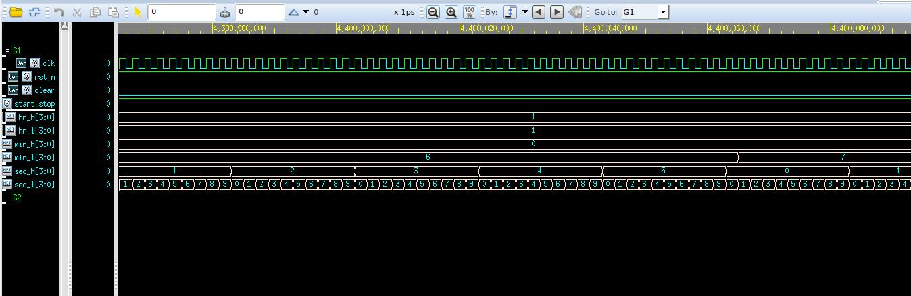
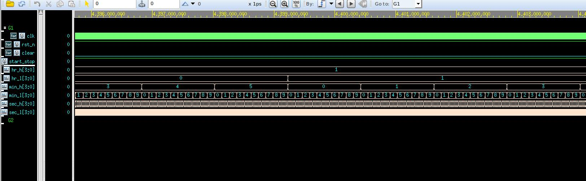
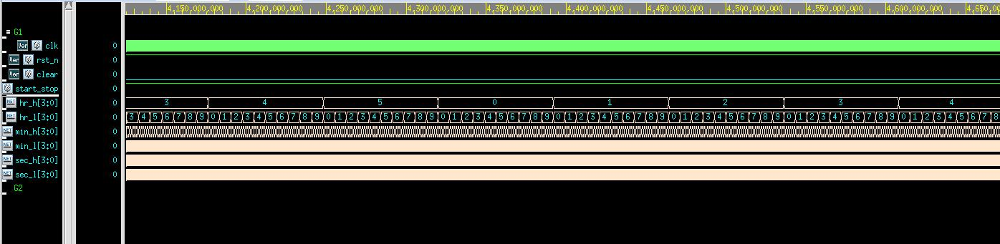
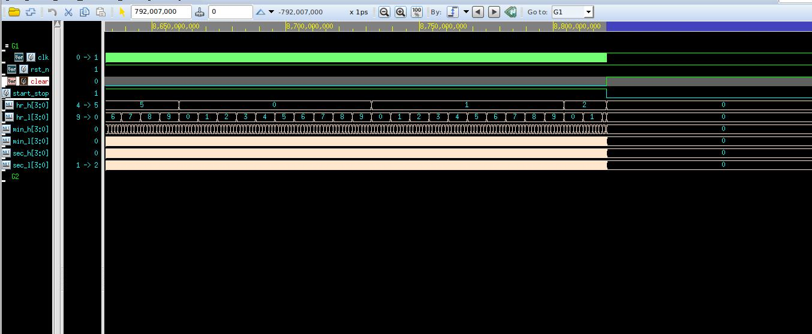
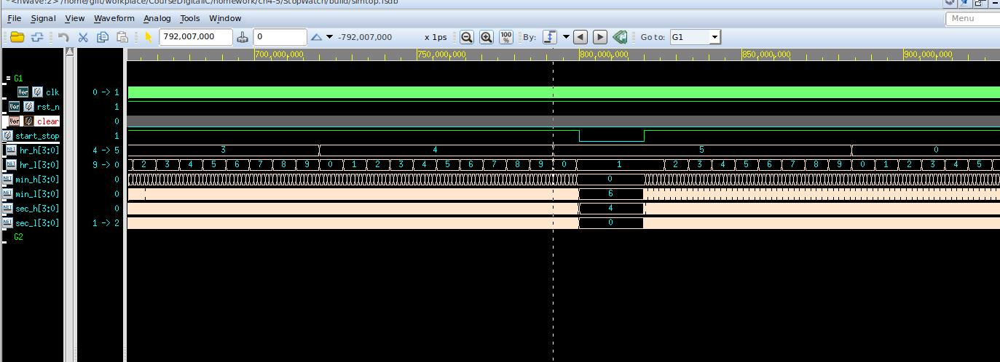
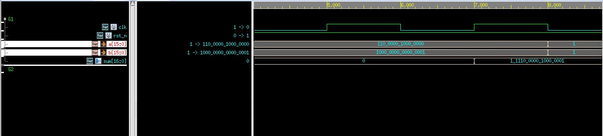
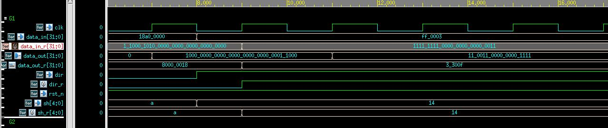

<!--
 * @Author: WenJiaBao-2022E8020282071
 * @Date: 2022-10-04 12:53:02
 * @LastEditTime: 2022-10-23 23:25:51
 * @Description: 高等数字集成电路作业-2022-10-06
 * 
 * Copyright (c) 2022 by WenJiaBao wenjiabao0919@163.com, All Rights Reserved. 
-->
# <p align="middle">高等数字集成电路作业-第四五章  </p>  
<p align="right">Author: 文家宝</p>  

## 1. 基础概念问题
<br>

1. 请简要描述10进制整数与16进制整数之间相互转换方法？  
    
   将10进制整数通过除2取余数的方法得到2进制表示，再将2进制数按照每4位表示一个16进制数的方式转成16进制表示。  
2. 请简要描述数的原码、反码和补码的表示方式和对应表示数值范围？  

    原码：原码就是符号位加上真值的绝对值, 即用第一位表示符号, 其余位表示值

[+1]原 = 0000 0001

[-1]原 = 1000 0001

8位二进制表示数的范围：[-127 , 127]
3. 请简要描述格雷码编码方式和优点，并具体给出5位格雷码映射关系表格？？  
    
    格雷码：在一组数的编码中，使得任意两个相邻的代码只有一位二进制数不同。二进制转变为格雷码通过相邻位异或实现
| <p align="middle">自然二进制数</p>  | <p align="middle">5位格雷码</p>  |   
|---|---|
|  <p align="middle">00000  </p> | <p align="middle">00000  </p>  |  
|  <p align="middle">00001  </p> | <p align="middle">00001  </p>  | 
|  <p align="middle">00010  </p> | <p align="middle">00011  </p>  | 
|  <p align="middle">00011  </p> | <p align="middle">00110  </p>  | 
|  <p align="middle">00100  </p> | <p align="middle">00111  </p>  | 
|  <p align="middle">00101  </p> | <p align="middle">00101  </p>  | 
|  <p align="middle">00110  </p> | <p align="middle">00100  </p>  | 
|  <p align="middle">00111  </p> | <p align="middle">01100  </p>  | 
|  <p align="middle">01000  </p> | <p align="middle">01101  </p>  | 
|  <p align="middle">01001  </p> | <p align="middle">01111  </p>  | 
|  <p align="middle">01010  </p> | <p align="middle">01110  </p>  | 
|  <p align="middle">01011  </p> | <p align="middle">01010  </p>  | 
|  <p align="middle">01100  </p> | <p align="middle">01011  </p>  | 
|  <p align="middle">01101  </p> | <p align="middle">01001  </p>  | 
|  <p align="middle">01110  </p> | <p align="middle">01000  </p>  | 
|  <p align="middle">01111  </p> | <p align="middle">11000  </p>  | 
|  <p align="middle">10000  </p> | <p align="middle">11001  </p>  | 
|  <p align="middle">10001  </p> | <p align="middle">11011  </p>  | 
|  <p align="middle">10010  </p> | <p align="middle">11010  </p>  | 
|  <p align="middle">10011  </p> | <p align="middle">11110  </p>  | 
|  <p align="middle">10100  </p> | <p align="middle">11111  </p>  | 
|  <p align="middle">10110  </p> | <p align="middle">11101  </p>  | 
|  <p align="middle">10111  </p> | <p align="middle">11100  </p>  | 
|  <p align="middle">11000  </p> | <p align="middle">10100  </p>  | 
|  <p align="middle">11001  </p> | <p align="middle">10101  </p>  | 
|  <p align="middle">11010  </p> | <p align="middle">10111  </p>  | 
|  <p align="middle">11011  </p> | <p align="middle">10110  </p>  | 
|  <p align="middle">11100  </p> | <p align="middle">10010  </p>  | 
|  <p align="middle">11101  </p> | <p align="middle">10011  </p>  | 
|  <p align="middle">11110  </p> | <p align="middle">10001  </p>  | 
|  <p align="middle">11111  </p> | <p align="middle">10000  </p>  | 
优点：在相邻位间转换时，只有一位产生变化。大大地减少了由一个状态到下一个状态时逻辑的混淆。
    
4. 请简要描述IEEE 754标准中32位单精度浮点数格式、范围和精度？简要比较并分析浮点数和定点数在硬件实现方面的优缺点？  

    浮点数：优点：能够表示高精度，范围大
    ​缺点：计算电路非常复杂
    定点数：优点：计算电路很简单
    ​缺点：不能够表示高精度，范围小  
 

## 2. 基于VerilogHDL进行逻辑电路设计
<br>

### 1. **跑表**  
设计一个跑表时序逻辑电路，通过按钮控制及数字显示，有时分秒显示，可以清零、开始和暂停。系统主时钟频率为10 MH。
其中按钮Clear实现清零功能（任意状态按下时分秒值清零并停止计时）、按钮Start/Stop实现开始和暂停功能（若当前状态为停止则按下继续进行计时，若当前状态为计时则按下暂停计时）。


模块输入输出功能定义：       

| <p align="middle">名称</p>  | <p align="middle">方向</p>  |  <p align="middle">位宽</p> | <p align="middle">描述</p>  |   
|---|---|---|---|
|  <p align="middle">clk  </p> | <p align="middle">Input  </p>  |  <p align="middle">1  </p> | <p align="middle">系统时钟，10 MHz  </p>  |  
|  <p align="middle">rst_n  </p> | <p align="middle">Input  </p>  |  <p align="middle">1 </p> | <p align="middle">异步复位，低电平有效  </p>  |  
|  <p align="middle">clear  </p> | <p align="middle">Input  </p>  |  <p align="middle">1  </p> | <p align="middle">清零按钮，上升沿有效  </p>  |  
|  <p align="middle">start_stop  </p> | <p align="middle">Input  </p>  |  <p align="middle">1  </p> | <p align="middle">开始/暂停按钮，上升沿有效  </p>  |  
|  <p align="middle">hr_h  </p> | <p align="middle">Output  </p>  |  <p align="middle">4  </p> | <p align="middle">时高位输出，取值0~5  </p>  |  
|  <p align="middle">hr_l  </p> | <p align="middle">Output  </p>  |  <p align="middle">4  </p> | <p align="middle">时低位输出，取值0~9  </p>  |  
|  <p align="middle">min_h  </p> | <p align="middle">Output  </p>  |  <p align="middle">4  </p> | <p align="middle">分高位输出，取值0~5 </p>  |  
|  <p align="middle">min_l  </p> | <p align="middle">Output  </p>  |  <p align="middle">4  </p> | <p align="middle">分低位输出，取值0~9  </p>  |  
|  <p align="middle">sec_h  </p> | <p align="middle">Output  </p>  |  <p align="middle">4  </p> | <p align="middle">秒高位输出，取值0~5  </p>  |  
|  <p align="middle">sec_l  </p> | <p align="middle">Output  </p>  |  <p align="middle">4 </p> | <p align="middle">秒低位输出，取值0~9  </p>  |  

**实现思路：**
```verilog
always @(posedge clk or negedge rst_n) begin
   if (!rst_n)begin
      sec_h <= 4'b0;
      sec_l <= 4'b0;
      sec_cout<=1'd0;
   end else if (clear)begin
      sec_l <= 0;
      sec_h <= 0;
      sec_cout<=1'd0;
   end else if (start_stop)begin
      
      if(sec_l>=4'd9)begin
         sec_l <= 0;
         if(sec_h>=4'd5)begin
            sec_cout<=1'd1;
            sec_h <= 0;
         end else begin
            sec_h <= sec_h +4'd1;
            sec_cout<=1'd0;
         end
      end else begin
         
         sec_h <= sec_h;
         sec_l <= sec_l +4'd1;
         sec_cout<=1'd0;
      end
      
   end else begin
      sec_l <= sec_l;
      sec_h <= sec_h;
      sec_cout<=sec_cout;
   end
end
reg min_cout; 
always @(posedge clk or negedge rst_n) begin
   if (!rst_n)begin
      min_h <= 7'b0;
      min_l <= 7'b0;
      min_cout<=1'd0;
   end else if (clear)begin
      min_l <= 0;
      min_h <= 0;
      min_cout<=1'd0;
   end else begin
      if(min_l>=4'd9)begin
        // $display("%d",min_l);
         if(sec_cout)begin
            min_l <= 0;
         end
         if(min_h>=4'd5&&sec_cout)begin
            min_cout<=1'd1;
            min_h <= 0;
         end else if(sec_cout)begin
            min_h <= min_h +4'd1;
            min_cout<=1'd0;
         end
      end else begin
         min_h <= min_h;
         min_l <= min_l +sec_cout;
         min_cout<=1'd0;
      end
   end
end
reg hr_cout; 
always @(posedge clk or negedge rst_n) begin
   if (!rst_n)begin
      hr_h <= 7'b0;
      hr_l <= 7'b0;
      hr_cout<=1'd0;
   end else if (clear)begin
      hr_l <= 0;
      hr_h <= 0;
      hr_cout<=1'd0;
   end else begin
      if(hr_l>=4'd9)begin
         if(min_cout)begin
            hr_l <= 0;
         end
         if(hr_h>=4'd5&&min_cout)begin
            hr_cout<=1'd1;
            hr_h <= 0;
         end else if(min_cout&&hr_l==4'd9)begin
            hr_h <= hr_h +4'd1;
            hr_cout<=1'd0;
         end
      end else begin
         hr_h <= hr_h;
         hr_l <= hr_l +min_cout;
         hr_cout<=1'd0;
      end
   end
end
endmodule

```
仿真截图：  
  
  
  
  
  
逻辑综合：     
采用smic180nm工艺库PVT环境为SS工艺角进行综合，时钟最高频率为434Mhz，采用最小面积约束进行综合
```
#==================================Env Vars===================================
set RST_NAME				rst_n
set CLK_NAME				clk

set CLK_PERIOD_I			10
set CLK_PERIOD            	[expr $CLK_PERIOD_I*0.95]
set CLK_SKEW              	[expr $CLK_PERIOD*0.05]
set CLK_SOURCE_LATENCY   	[expr $CLK_PERIOD*0.1]    
set CLK_NETWORK_LATENCY   	[expr $CLK_PERIOD*0.1]  
set CLK_TRAN             	[expr $CLK_PERIOD*0.01]

set INPUT_DELAY_MAX         [expr $CLK_PERIOD*0.4]
set INPUT_DELAY_MIN           0
set OUTPUT_DELAY_MAX        [expr $CLK_PERIOD*0.4]
set OUTPUT_DELAY_MIN          0

set MAX_FANOUT             6
set MAX_TRAN               5
set MAX_CAP                1.5

set ALL_INPUT_EX_CLK [remove_from_collection [all_inputs] [get_ports $CLK_NAME]]
#==================================Define Design Environment=========================
#GUIDANCE: use the default
set_max_area 0
#set_max_transition  $MAX_TRAN     [current_design]
#set_max_fanout      $MAX_FANOUT   [current_design]
#set_max_capacitance $MAX_CAP      [current_design]

#============================= Set Design Constraints=========================
#--------------------------------Clock and Reset Definition----------------------------
set_drive 0 [get_ports $CLK_NAME]
create_clock -name $CLK_NAME -period $CLK_PERIOD [get_ports $CLK_NAME]
set_dont_touch_network [get_ports $CLK_NAME]

set_clock_uncertainty $CLK_SKEW [get_clocks $CLK_NAME]
set_clock_transition  $CLK_TRAN [all_clocks]
set_clock_latency -source $CLK_SOURCE_LATENCY [get_clocks $CLK_NAME]
set_clock_latency -max $CLK_NETWORK_LATENCY [get_clocks $CLK_NAME]
#rst_ports
set_drive 0            				[get_ports $RST_NAME]
set_dont_touch_network 				[get_ports $RST_NAME]
set_false_path -from   				[get_ports $RST_NAME] 
set_ideal_network -no_propagate     [get_ports $RST_NAME]


#--------------------------------I/O Constraint-----------------------------
set_input_delay   -max $INPUT_DELAY_MAX   -clock $CLK_NAME   $ALL_INPUT_EX_CLK
set_input_delay   -min $INPUT_DELAY_MIN   -clock $CLK_NAME   $ALL_INPUT_EX_CLK -add
set_output_delay  -max $OUTPUT_DELAY_MAX  -clock $CLK_NAME   [all_outputs]
set_output_delay  -min $OUTPUT_DELAY_MIN  -clock $CLK_NAME   [all_outputs] -add
set_load  0.2 	[all_outputs]	
  Point                                    Incr       Path
  -----------------------------------------------------------
  clock clk (rise edge)                    0.00       0.00
  clock network delay (ideal)              1.90       1.90
  watch_u0/sec_h_reg_0_/CK (DFFRQX1M)      0.00       1.90 r
  watch_u0/sec_h_reg_0_/Q (DFFRQX1M)       1.86       3.76 r
  watch_u0/sec_h[0] (watch)                0.00       3.76 r
  sec_h[0] (out)                           0.00       3.76 r
  data arrival time                                   3.76

  clock clk (rise edge)                    9.50       9.50
  clock network delay (ideal)              1.90      11.40
  clock uncertainty                       -0.47      10.92
  output external delay                   -3.80       7.12
  data required time                                  7.12
  -----------------------------------------------------------
  data required time                                  7.12
  data arrival time                                  -3.76
  -----------------------------------------------------------
  slack (MET)                                         3.36

                 Internal         Switching           Leakage            Total
Power Group      Power            Power               Power              Power   (   %    )  Attrs
--------------------------------------------------------------------------------------------------
io_pad             0.0000            0.0000            0.0000            0.0000  (   0.00%)
memory             0.0000            0.0000            0.0000            0.0000  (   0.00%)
black_box          0.0000            0.0000            0.0000            0.0000  (   0.00%)
clock_network      0.0000            0.0000            0.0000            0.0000  (   0.00%)
register           0.2202        8.6813e-03        3.4926e+04            0.2289  (  95.57%)
sequential         0.0000            0.0000            0.0000            0.0000  (   0.00%)
combinational  5.5845e-03        4.9921e-03        3.8542e+04        1.0615e-02  (   4.43%)
--------------------------------------------------------------------------------------------------
Total              0.2258 mW     1.3673e-02 mW     7.3468e+04 pW         0.2395 mW

Library(s) Used:

    ss_1v62_125c (File: /opt/PDKs/smic_180/SM00LB501-FE-00000-r0p0-00rel0/aci/sc-m/synopsys/ss_1v62_125c.db)

Number of ports:                           73
Number of nets:                           185
Number of cells:                          135
Number of combinational cells:            100
Number of sequential cells:                32
Number of macros/black boxes:               0
Number of buf/inv:                         13
Number of references:                       2

Combinational area:               1251.263981
Buf/Inv area:                       85.612799
Noncombinational area:            1442.246437
Macro/Black Box area:                0.000000
Net Interconnect area:      undefined  (No wire load specified)

Total cell area:                  2693.510418
```


### 2. 快速加法器  
实现快速加法器组合逻辑，要实现的功能如下：
输入为两个16位有符号数，输出17位相加结果。要求采用超前进位（Carry-look-ahead）结构
       
**0**110000010000000 + **1**000000000000001 = **1**1110000010000001
(24704) + (-32767) = (-8063)

 

模块输入输出功能定义：       

| <p align="middle">名称</p>  | <p align="middle">方向</p>  |  <p align="middle">位宽</p> | <p align="middle">描述</p>  |   
|---|---|---|---|
|  <p align="middle">a  </p> | <p align="middle">Input  </p>  |  <p align="middle">16  </p> | <p align="middle">输入数据，二进制补码  </p>  |  
|  <p align="middle">b  </p> | <p align="middle">Input  </p>  |  <p align="middle">16  </p> | <p align="middle">输入数据，二进制补码  </p>  |  
|  <p align="middle">sum  </p> | <p align="middle">Input  </p>  |  <p align="middle">17  </p> | <p align="middle">输出和a + b，二进制补码  </p>  | 


**实现思路一：快速加法器**
```verilog
module adder(
    input   a,
    input   b,
    input   ci,
    output  sum
);
  assign sum = a ^ b ^ ci;
endmodule 


module cla(
    input c0,
	output c1,
	output c2,
	output c3,
	output c4,
	input p1,
	input p2,
	input p3,
	input p4,
	input g1,
	input g2,
	input g3,
	input g4
);

	assign  c1 = g1 ^ (p1 & c0);
	assign  c2 = g2 ^ (p2 & g1) ^ (p2 & p1 & c0);
	assign	c3 = g3 ^ (p3 & g2) ^ (p3 & p2 & g1) ^ (p3 & p2 & p1 & c0);
	assign	c4 = g4 ^ (p4&g3)^(p4&p3&g2)^(p4&p3&p2&g1)^(p4&p3&p2&p1&c0);
	 
endmodule 

module adder_cla4(
      input [3:0] a,
	  input [3:0] b,
	  input  ci,
      output Gm,
      output Pm,
	  output [3:0] sum
);	  	  
    wire p1,p2,p3,p4,g1,g2,g3,g4;
    wire c1,c2,c3;
    
    adder adder_u0(
        .a(a[0]),
        .b(b[0]),
        .ci(ci),
        .sum(sum[0])
    );
		
	adder adder_u1(
        .a(a[1]),
        .b(b[1]),
        .ci(c1),
        .sum(sum[1])
    );	
		
	adder adder_u2(
        .a(a[2]),
        .b(b[2]),
        .ci(c2),
        .sum(sum[2])
    );
			
	adder adder_u3(
        .a(a[3]),
        .b(b[3]),
        .ci(c3),
        .sum(sum[3])
    );		
		
	cla cla(
		.c0(ci),
		.c1(c1),
		.c2(c2),
		.c3(c3),
		.c4(),
		.p1(p1),
		.p2(p2),
		.p3(p3),
		.p4(p4),
		.g1(g1),
		.g2(g2),
		.g3(g3),
		.g4(g4)
	);
				
    assign   p1 = a[0] ^ b[0];
    assign   p2 = a[1] ^ b[1];
	assign	 p3 = a[2] ^ b[2];
	assign	 p4 = a[3] ^ b[3];
    assign   g1 = a[0] & b[0];
    assign   g2 = a[1] & b[1];
    assign   g3 = a[2] & b[2];
	assign   g4 = a[3] & b[3];

  assign Pm = p1 & p2 & p3 & p4;
  assign Gm = g4 ^ (p4 & g3) ^ (p4 & p3 & g2) ^ (p4 & p3 & p2 & g1);

endmodule 


module cla16(
    input   [15:0]  a_i,
    input   [15:0]  b_i,
    output  [16:0]  sum_o
);


	
	wire c4,c8,c12;
	wire Pm1,Gm1,Pm2,Gm2,Pm3,Gm3,Pm4,Gm4;
	
	adder_cla4 adder_4_u0(
	  .a(a_i[3:0]),
      .b(b_i[3:0]),
      .ci(1'b0),
      .Gm(Gm1),
      .Pm(Pm1),
	  .sum(sum_o[3:0])
	);
	
	adder_cla4 adder_4_u1(
	  .a(a_i[7:4]),
	  .b(b_i[7:4]),
	  .ci(c4),
      .Gm(Gm2),
      .Pm(Pm2),
	  .sum(sum_o[7:4])
	);
	
    adder_cla4 adder_4_u2(
	  .a(a_i[11:8]),
	  .b(b_i[11:8]),
	  .ci(c8),
      .Gm(Gm3),
      .Pm(Pm3),
	  .sum(sum_o[11:8])
	);

    adder_cla4 adder_4_u3(
	  .a(a_i[15:12]),
	  .b(b_i[15:12]),
	  .ci(c12),
      .Gm(Gm4),
      .Pm(Pm4),
	  .sum(sum_o[15:12])
	);
	
    
	assign   c4 = Gm1 ;
	assign   c8 = Gm2 ^ (Pm2 & Gm1) ;
	assign   c12 = Gm3 ^ (Pm3 & Gm2) ^ (Pm3 & Pm2 & Gm1) ;
    assign   sum_o[16] = sum_o[15];


```
仿真截图：  


逻辑综合：     
采用smic180nm工艺库PVT环境为SS工艺角进行综合，时钟最高频率为，采用最小面积约束进行综合
```

#==================================Env Vars===================================
set RST_NAME				rst_n
set CLK_NAME				clk

set CLK_PERIOD_I			2.5
set CLK_PERIOD            	[expr $CLK_PERIOD_I*0.95]
set CLK_SKEW              	[expr $CLK_PERIOD*0.05]
set CLK_SOURCE_LATENCY   	[expr $CLK_PERIOD*0.1]    
set CLK_NETWORK_LATENCY   	[expr $CLK_PERIOD*0.1]  
set CLK_TRAN             	[expr $CLK_PERIOD*0.01]

set INPUT_DELAY_MAX         [expr $CLK_PERIOD*0.4]
set INPUT_DELAY_MIN           0
set OUTPUT_DELAY_MAX        [expr $CLK_PERIOD*0.4]
set OUTPUT_DELAY_MIN          0

set MAX_FANOUT             6
set MAX_TRAN               5
set MAX_CAP                1.5

set ALL_INPUT_EX_CLK [remove_from_collection [all_inputs] [get_ports $CLK_NAME]]
#==================================Define Design Environment=========================
#GUIDANCE: use the default
set_max_area 0
#set_max_transition  $MAX_TRAN     [current_design]
#set_max_fanout      $MAX_FANOUT   [current_design]
#set_max_capacitance $MAX_CAP      [current_design]

#============================= Set Design Constraints=========================
#--------------------------------Clock and Reset Definition----------------------------
set_drive 0 [get_ports $CLK_NAME]
create_clock -name $CLK_NAME -period $CLK_PERIOD [get_ports $CLK_NAME]
set_dont_touch_network [get_ports $CLK_NAME]

set_clock_uncertainty $CLK_SKEW [get_clocks $CLK_NAME]
set_clock_transition  $CLK_TRAN [all_clocks]
set_clock_latency -source $CLK_SOURCE_LATENCY [get_clocks $CLK_NAME]
set_clock_latency -max $CLK_NETWORK_LATENCY [get_clocks $CLK_NAME]
#rst_ports
set_drive 0            				[get_ports $RST_NAME]
set_dont_touch_network 				[get_ports $RST_NAME]
set_false_path -from   				[get_ports $RST_NAME] 
set_ideal_network -no_propagate     [get_ports $RST_NAME]


#--------------------------------I/O Constraint-----------------------------
set_input_delay   -max $INPUT_DELAY_MAX   -clock $CLK_NAME   $ALL_INPUT_EX_CLK
set_input_delay   -min $INPUT_DELAY_MIN   -clock $CLK_NAME   $ALL_INPUT_EX_CLK -add
set_output_delay  -max $OUTPUT_DELAY_MAX  -clock $CLK_NAME   [all_outputs]
set_output_delay  -min $OUTPUT_DELAY_MIN  -clock $CLK_NAME   [all_outputs] -add
set_load  0.2 	[all_outputs]	

Number of ports:                          276
Number of nets:                           453
Number of cells:                          230
Number of combinational cells:            154
Number of sequential cells:                51
Number of macros/black boxes:               0
Number of buf/inv:                         21
Number of references:                       7

Combinational area:               3055.718386
Buf/Inv area:                      155.859198
Noncombinational area:            3178.649651
Macro/Black Box area:                0.000000
Net Interconnect area:      undefined  (No wire load specified)

Total cell area:                  6234.368036

                 Internal         Switching           Leakage            Total
Power Group      Power            Power               Power              Power   (   %    )  Attrs
--------------------------------------------------------------------------------------------------
io_pad             0.0000            0.0000            0.0000            0.0000  (   0.00%)
memory             0.0000            0.0000            0.0000            0.0000  (   0.00%)
black_box          0.0000            0.0000            0.0000            0.0000  (   0.00%)
clock_network      0.0000            0.0000            0.0000            0.0000  (   0.00%)
register           3.0447            0.3186        1.2987e+05            3.3634  (  93.08%)
sequential         0.0000            0.0000            0.0000            0.0000  (   0.00%)
combinational      0.1771        7.2620e-02        1.7797e+05            0.2499  (   6.92%)
--------------------------------------------------------------------------------------------------
Total              3.2218 mW         0.3912 mW     3.0784e+05 pW         3.6133 mW

```


<br/>

### 1. **桶形移位器**  
实现桶形移位器组合逻辑，要实现的功能如下：
输入为32位二进制向量，根据方向和位移值输出循环移位后的32位结果。例如：
输入向量0001100010**1000000000000000000000**，方向左，位移值10，输出向量**1000000000000000000000**0001100010；
输入向量**000000001111**11110000000000000011，方向右，位移植20，输出向量11110000000000000011**000000001111**.


模块输入输出功能定义：       

| <p align="middle">名称</p>  | <p align="middle">方向</p>  |  <p align="middle">位宽</p> | <p align="middle">描述</p>  |   
|---|---|---|---|
|  <p align="middle">data_in  </p> | <p align="middle">Input  </p>  |  <p align="middle">32  </p> | <p align="middle">输入数据  </p>  |  
|  <p align="middle">dir  </p> | <p align="middle">Input  </p>  |  <p align="middle">1  </p> | <p align="middle">位移方向0：循环左移  1：循环右移  </p>  |  
|  <p align="middle">sh  </p> | <p align="middle">Input  </p>  |  <p align="middle">5  </p> | <p align="middle">位移值，取值0~31  </p>  |  
|  <p align="middle">data_out  </p> | <p align="middle">Output  </p>  |  <p align="middle">32  </p> | <p align="middle">输出数据  </p>  |  
|

**实现思路**
```verilog
    always @(*)begin
	if(dir)begin  // right
		data_out = sh[0] ? {data_in[0], data_in[31:1]} : data_in;
		data_out = sh[1] ? {data_in[1:0], data_out[31:2]} : data_out;
		data_out = sh[2] ? {data_in[3:0], data_out[31:4]} : data_out;
		data_out = sh[3] ? {data_in[7:0], data_out[31:8]} : data_out;
		data_out = sh[4] ? {data_in[15:0], data_out[31:16]} : data_out;
	end else begin  // left
		data_out = sh[0] ? {data_in[30:0], data_in[31]} : data_in;
		data_out = sh[1] ? {data_out[29:0], data_in[31:30]} : data_out;
		data_out = sh[2] ? {data_out[27:0], data_in[31:28]} : data_out;
		data_out = sh[3] ? {data_out[23:0], data_in[31:24]} : data_out;
		data_out = sh[4] ? {data_out[15:0], data_in[31:16]} : data_out;
	end
end
```
仿真截图：  


逻辑综合：     
采用smic180nm工艺库PVT环境为SS工艺角进行综合，时钟最高频率为200Mhz，采用最小面积约束进行综合
```

#==================================Env Vars===================================
set RST_NAME				rst_n
set CLK_NAME				clk

set CLK_PERIOD_I			10
set CLK_PERIOD            	[expr $CLK_PERIOD_I*0.95]
set CLK_SKEW              	[expr $CLK_PERIOD*0.05]
set CLK_SOURCE_LATENCY   	[expr $CLK_PERIOD*0.1]    
set CLK_NETWORK_LATENCY   	[expr $CLK_PERIOD*0.1]  
set CLK_TRAN             	[expr $CLK_PERIOD*0.01]

set INPUT_DELAY_MAX         [expr $CLK_PERIOD*0.4]
set INPUT_DELAY_MIN           0
set OUTPUT_DELAY_MAX        [expr $CLK_PERIOD*0.4]
set OUTPUT_DELAY_MIN          0

set MAX_FANOUT             6
set MAX_TRAN               5
set MAX_CAP                1.5

set ALL_INPUT_EX_CLK [remove_from_collection [all_inputs] [get_ports $CLK_NAME]]
#==================================Define Design Environment=========================
#GUIDANCE: use the default
set_max_area 0
#set_max_transition  $MAX_TRAN     [current_design]
#set_max_fanout      $MAX_FANOUT   [current_design]
#set_max_capacitance $MAX_CAP      [current_design]

#============================= Set Design Constraints=========================
#--------------------------------Clock and Reset Definition----------------------------
set_drive 0 [get_ports $CLK_NAME]
create_clock -name $CLK_NAME -period $CLK_PERIOD [get_ports $CLK_NAME]
set_dont_touch_network [get_ports $CLK_NAME]

set_clock_uncertainty $CLK_SKEW [get_clocks $CLK_NAME]
set_clock_transition  $CLK_TRAN [all_clocks]
set_clock_latency -source $CLK_SOURCE_LATENCY [get_clocks $CLK_NAME]
set_clock_latency -max $CLK_NETWORK_LATENCY [get_clocks $CLK_NAME]
#rst_ports
set_drive 0            				[get_ports $RST_NAME]
set_dont_touch_network 				[get_ports $RST_NAME]
set_false_path -from   				[get_ports $RST_NAME] 
set_ideal_network -no_propagate     [get_ports $RST_NAME]


#--------------------------------I/O Constraint-----------------------------
set_input_delay   -max $INPUT_DELAY_MAX   -clock $CLK_NAME   $ALL_INPUT_EX_CLK
set_input_delay   -min $INPUT_DELAY_MIN   -clock $CLK_NAME   $ALL_INPUT_EX_CLK -add
set_output_delay  -max $OUTPUT_DELAY_MAX  -clock $CLK_NAME   [all_outputs]
set_output_delay  -min $OUTPUT_DELAY_MIN  -clock $CLK_NAME   [all_outputs] -add
set_load  0.2 	[all_outputs]	

 
****************************************
Report : timing
        -path full
        -delay max
        -max_paths 1
Design : top
Version: L-2016.03-SP1
Date   : Sun Oct 23 23:02:29 2022
****************************************

Operating Conditions: ss_1v62_125c   Library: ss_1v62_125c
Wire Load Model Mode: top

  Startpoint: data_out_reg_0_
              (rising edge-triggered flip-flop clocked by clk)
  Endpoint: data_out[0]
            (output port clocked by clk)
  Path Group: clk
  Path Type: max

  Point                                    Incr       Path
  -----------------------------------------------------------
  clock clk (rise edge)                    0.00       0.00
  clock network delay (ideal)              1.90       1.90
  data_out_reg_0_/CK (DFFRQX1M)            0.00       1.90 r
  data_out_reg_0_/Q (DFFRQX1M)             1.74       3.64 r
  data_out[0] (out)                        0.00       3.64 r
  data arrival time                                   3.64

  clock clk (rise edge)                    9.50       9.50
  clock network delay (ideal)              1.90      11.40
  clock uncertainty                       -0.47      10.92
  output external delay                   -3.80       7.12
  data required time                                  7.12
  -----------------------------------------------------------
  data required time                                  7.12
  data arrival time                                  -3.64
  -----------------------------------------------------------
  slack (MET)                                         3.49

                 Internal         Switching           Leakage            Total
Power Group      Power            Power               Power              Power   (   %    )  Attrs
--------------------------------------------------------------------------------------------------
io_pad             0.0000            0.0000            0.0000            0.0000  (   0.00%)
memory             0.0000            0.0000            0.0000            0.0000  (   0.00%)
black_box          0.0000            0.0000            0.0000            0.0000  (   0.00%)
clock_network      0.0000            0.0000            0.0000            0.0000  (   0.00%)
register           0.5165            0.1363        8.3525e+04            0.6529  (  87.15%)
sequential         0.0000            0.0000            0.0000            0.0000  (   0.00%)
combinational  4.8182e-02        4.7940e-02        1.5867e+05        9.6281e-02  (  12.85%)
--------------------------------------------------------------------------------------------------
Total              0.5647 mW         0.1842 mW     2.4220e+05 pW         0.7492 mW
1

Library(s) Used:

    ss_1v62_125c (File: /opt/PDKs/smic_180/SM00LB501-FE-00000-r0p0-00rel0/aci/sc-m/synopsys/ss_1v62_125c.db)

Number of ports:                          142
Number of nets:                           620
Number of cells:                          511
Number of combinational cells:            440
Number of sequential cells:                70
Number of macros/black boxes:               0
Number of buf/inv:                         30
Number of references:                       2

Combinational area:               5250.918320
Buf/Inv area:                      197.567997
Noncombinational area:            3226.944084
Macro/Black Box area:                0.000000
Net Interconnect area:      undefined  (No wire load specified)

Total cell area:                  8477.862404

```


