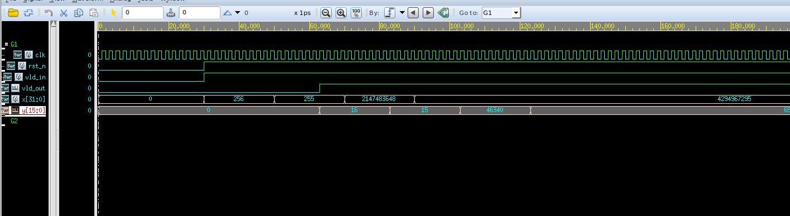
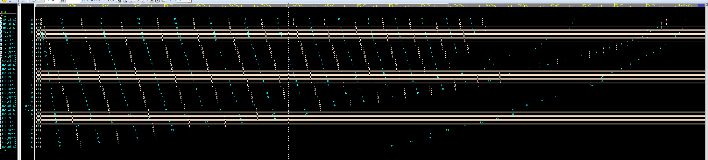
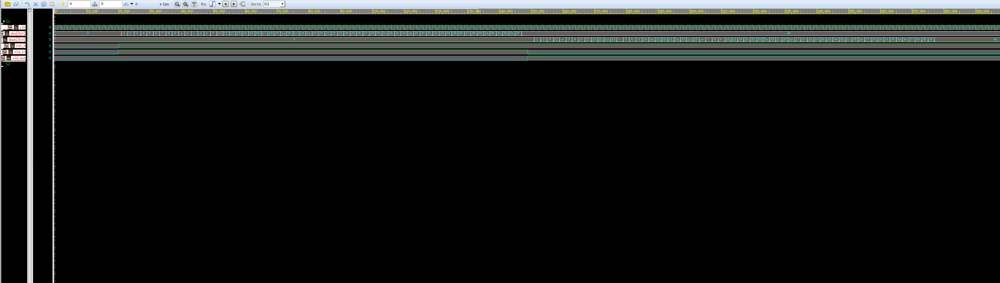
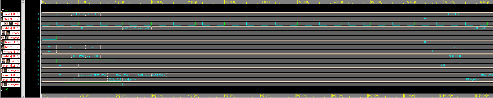

<!--
 * @Author: WenJiaBao-2022E8020282071
 * @Date: 2022-10-04 12:53:02
 * @LastEditTime: 2022-11-13 19:12:20
 * @Description: 高等数字集成电路作业-2022-10-06
 * 
 * Copyright (c) 2022 by WenJiaBao wenjiabao0919@163.com, All Rights Reserved. 
-->
# <p align="middle">高等数字集成电路作业-第六七章  </p>  
<p align="right">Author: 文家宝</p>  

## 1. 基础概念问题
<br>

1. 请简要描述Mealy状态机与Moore状态机的特性及它们之间的联系？
    
   Moore状态机：输出仅仅与当前状态有关；

   Mealy状态机：输出不仅取决于当前状态，还和输入有关；


2. 请简要描述SRAM的特点以及实际应用中与寄存器堆逻辑的优缺点比较？

   SRAM的特点是工作速度快，只要电源不撤除，写入SRAM的信息就不会消失，不需要刷新电路，同时在读出时不破坏原来存放的信息，一经写入可多次读出，但集成度较低，功耗较大。

   寄存器堆逻辑实现上更为简单，但性能远不如工艺优化后的SRAM。而SRAM性能虽强，但是实现上略微复杂。  


3. 请简要描述门控时钟常见电路结构以及适用范围？  
    
   门控时钟电路结构包括直接将控制信号与时钟信号进行与操作（会产生毛刺，因此实际中很少使用）


4. 请简要描述AHB总线与APB总线的基本特性以及在实际SoC系统中它们的适用场合？

    AHB(Advanced High-performance Bus), 为高速总线，一般用来连接高速外设。APB (Advanced Peripheral Bus) 为低速总线，一般用来接低速外设。

   在SoC系统中，AHB总线会挂载ARM处理器，RAM，DMA控制器等设备，通过AHB2APB Bridge与APB总线连接，APB上挂在UART，Timer等低速设备。
 

## 2. 基于VerilogHDL进行逻辑电路设计
<br>

### 1. **平方根计算**  
设计一个时序逻辑电路，计算32位非负整数的平方根。对于输入x，计算y = floor(sqrt(x))，即y是平方后不超过x的最大非负整数。例如：

l 输入x = 256，输出y = 16

l 输入x = 255，输出y = 15

l 输入x = 2147483648，输出y = 46340

l 输入x = 4294967295，输出y = 65535

顶层模块名为sqrt_u32，输入输出功能定义：

模块输入输出功能定义：       

| <p align="middle">名称</p>  | <p align="middle">方向</p>  |  <p align="middle">位宽</p> | <p align="middle">描述</p>  |   
|---|---|---|---|
|  <p align="middle">clk  </p> | <p align="middle">Input  </p>  |  <p align="middle">1  </p> | <p align="middle">系统时钟  </p>  |  
|  <p align="middle">rst_n  </p> | <p align="middle">Input  </p>  |  <p align="middle">1 </p> | <p align="middle">系统异步复位，低电平有效  </p>  |  
|  <p align="middle">vld_in  </p> | <p align="middle">Input  </p>  |  <p align="middle">1  </p> | <p align="middle">输入数据有效指示  </p>  |  
|  <p align="middle">x  </p> | <p align="middle">Output  </p>  |  <p align="middle">32  </p> | <p align="middle">输入被开方数据  </p>  |  
|  <p align="middle">vld_out  </p> | <p align="middle">Output  </p>  |  <p align="middle">1  </p> | <p align="middle">输出数据有效指示  </p>  |  
|  <p align="middle">y  </p> | <p align="middle">Output  </p>  |  <p align="middle">16  </p> | <p align="middle">输出结果数据 </p>  |  
|  <p align="middle">

**实现思路：**
```verilog
    always@(posedge clk or negedge  rst_n)begin
        if(!rst_n)begin
            D[q_width] <= 0;
            Q_z[q_width] <= 0;
            Q_q[q_width] <= 0;
            valid_flag[q_width] <= 0;
        end else if(vld_in) begin
            D[q_width] <= x; 
            Q_z[q_width] <= {1'b1,{(q_width-1){1'b0}}}; 
            Q_q[q_width] <= 0; 
            valid_flag[q_width] <= 1;
        end else begin
            D[q_width] <= 0;
            Q_z[q_width] <= 0;
            Q_q[q_width] <= 0;
            valid_flag[q_width] <= 0;
        end 
    end

generate
genvar i; 
    for(i=q_width-1;i>=1;i=i-1)begin:U
        always@(posedge clk or negedge  rst_n)begin
            if(!rst_n)begin
                D[i] <= 0;
                Q_z[i] <= 0;
                Q_q[i] <= 0;
                valid_flag[i] <= 0;
            end else if(valid_flag[i+1])begin
                if(Q_z[i+1]*Q_z[i+1] > D[i+1]) begin
                    Q_z[i] <= {Q_q[i+1][q_width-1:i],1'b1,{{i-1}{1'b0}}};
                    Q_q[i] <= Q_q[i+1];
                end else begin
                    Q_z[i] <= {Q_z[i+1][q_width-1:i],1'b1,{{i-1}{1'b0}}};
                    Q_q[i] <= Q_z[i+1];
                end
                D[i] <= D[i+1];
                valid_flag[i] <= 1;
            end else begin
                valid_flag[i] <= 0;
                D[i] <= 0;
                Q_q[i] <= 0;
                Q_z[i] <= 0;
            end
        end
    end
endgenerate

    always@(posedge clk or negedge  rst_n) begin
        if(!rst_n) begin
            y <= 0;
            vld_out <= 0;
        end else if(valid_flag[1]) begin
            if(Q_z[1]*Q_z[1] > D[1]) begin
                y <= Q_q[1];
                vld_out <= 1;
            end else begin
                y <= {Q_q[1][q_width-1:1],Q_z[1][0]};
                vld_out <= 1;
             end
        end
        else begin
            y <= 0;
            vld_out <= 0;
         end
    end

endmodule


```
仿真截图：  
  
 
逻辑综合：     
采用smic180nm工艺库PVT环境为SS工艺角进行综合，时钟最高频率为434Mhz，采用最小面积约束进行综合
```
#==================================Env Vars===================================
set RST_NAME				rst_n
set CLK_NAME				clk

set CLK_PERIOD_I			10
set CLK_PERIOD            	[expr $CLK_PERIOD_I*0.95]
set CLK_SKEW              	[expr $CLK_PERIOD*0.05]
set CLK_SOURCE_LATENCY   	[expr $CLK_PERIOD*0.1]    
set CLK_NETWORK_LATENCY   	[expr $CLK_PERIOD*0.1]  
set CLK_TRAN             	[expr $CLK_PERIOD*0.01]

set INPUT_DELAY_MAX         [expr $CLK_PERIOD*0.4]
set INPUT_DELAY_MIN           0
set OUTPUT_DELAY_MAX        [expr $CLK_PERIOD*0.4]
set OUTPUT_DELAY_MIN          0

set MAX_FANOUT             6
set MAX_TRAN               5
set MAX_CAP                1.5

set ALL_INPUT_EX_CLK [remove_from_collection [all_inputs] [get_ports $CLK_NAME]]
#==================================Define Design Environment=========================
#GUIDANCE: use the default
set_max_area 0
#set_max_transition  $MAX_TRAN     [current_design]
#set_max_fanout      $MAX_FANOUT   [current_design]
#set_max_capacitance $MAX_CAP      [current_design]

#============================= Set Design Constraints=========================
#--------------------------------Clock and Reset Definition----------------------------
set_drive 0 [get_ports $CLK_NAME]
create_clock -name $CLK_NAME -period $CLK_PERIOD [get_ports $CLK_NAME]
set_dont_touch_network [get_ports $CLK_NAME]

set_clock_uncertainty $CLK_SKEW [get_clocks $CLK_NAME]
set_clock_transition  $CLK_TRAN [all_clocks]
set_clock_latency -source $CLK_SOURCE_LATENCY [get_clocks $CLK_NAME]
set_clock_latency -max $CLK_NETWORK_LATENCY [get_clocks $CLK_NAME]
#rst_ports
set_drive 0            				[get_ports $RST_NAME]
set_dont_touch_network 				[get_ports $RST_NAME]
set_false_path -from   				[get_ports $RST_NAME] 
set_ideal_network -no_propagate     [get_ports $RST_NAME]


#--------------------------------I/O Constraint-----------------------------
set_input_delay   -max $INPUT_DELAY_MAX   -clock $CLK_NAME   $ALL_INPUT_EX_CLK
set_input_delay   -min $INPUT_DELAY_MIN   -clock $CLK_NAME   $ALL_INPUT_EX_CLK -add
set_output_delay  -max $OUTPUT_DELAY_MAX  -clock $CLK_NAME   [all_outputs]
set_output_delay  -min $OUTPUT_DELAY_MIN  -clock $CLK_NAME   [all_outputs] -add
set_load  0.2 	[all_outputs]	
  Point                                                   Incr       Path
  --------------------------------------------------------------------------
  clock clk (rise edge)                                   0.00       0.00
  clock network delay (ideal)                             1.90       1.90
  Q_z_reg_10__10_/CK (DFFRX1M)                            0.00       1.90 r
  Q_z_reg_10__10_/Q (DFFRX1M)                             0.76       2.66 r
  DP_OP_197_128_6467/I1[10] (top_DP_OP_197_128_6467_0)
                                                          0.00       2.66 r
  DP_OP_197_128_6467/U205/Y (AND2X1M)                     0.22       2.88 r
  DP_OP_197_128_6467/U144/S (ADDHX1M)                     0.12       3.00 r
  DP_OP_197_128_6467/U191/Y (INVXLM)                      0.12       3.12 f
  DP_OP_197_128_6467/U238/Y (AOI211X1M)                   0.27       3.39 r
  DP_OP_197_128_6467/U193/Y (AOI2BB2XLM)                  0.19       3.58 f
  DP_OP_197_128_6467/U237/Y (AOI222XLM)                   0.59       4.18 r
  DP_OP_197_128_6467/U236/Y (AOI222XLM)                   0.38       4.55 f
  DP_OP_197_128_6467/U235/Y (AOI222XLM)                   0.62       5.18 r
  DP_OP_197_128_6467/U234/Y (AOI222XLM)                   0.33       5.50 f
  DP_OP_197_128_6467/U233/Y (AOI222XLM)                   0.63       6.14 r
  DP_OP_197_128_6467/U232/Y (AOI222XLM)                   0.34       6.48 f
  DP_OP_197_128_6467/U231/Y (AOI222XLM)                   0.61       7.09 r
  DP_OP_197_128_6467/U230/Y (AOI222XLM)                   0.34       7.43 f
  DP_OP_197_128_6467/U229/Y (AOI222XLM)                   0.62       8.06 r
  DP_OP_197_128_6467/U227/Y (AOI222XLM)                   0.38       8.43 f
  DP_OP_197_128_6467/U226/Y (AOI222XLM)                   0.53       8.97 r
  DP_OP_197_128_6467/O1 (top_DP_OP_197_128_6467_0)        0.00       8.97 r
  U833/Y (INVXLM)                                         0.13       9.10 f
  U834/Y (NOR2XLM)                                        0.41       9.51 r
  U838/Y (AO22XLM)                                        0.27       9.77 r
  Q_z_reg_9__10_/D (DFFRX1M)                              0.00       9.77 r
  data arrival time                                                  9.77

  clock clk (rise edge)                                   9.50       9.50
  clock network delay (ideal)                             1.90      11.40
  clock uncertainty                                      -0.47      10.92
  Q_z_reg_9__10_/CK (DFFRX1M)                             0.00      10.92 r
  library setup time                                     -0.20      10.72
  data required time                                                10.72
  --------------------------------------------------------------------------
  data required time                                                10.72
  data arrival time                                                 -9.77
  --------------------------------------------------------------------------
  slack (MET)                                                        0.95

Total Dynamic Power    =   5.3822 mW  (100%)

Cell Leakage Power     =   3.4383 uW


                 Internal         Switching           Leakage            Total
Power Group      Power            Power               Power              Power   (   %    )  Attrs
--------------------------------------------------------------------------------------------------
io_pad             0.0000            0.0000            0.0000            0.0000  (   0.00%)
memory             0.0000            0.0000            0.0000            0.0000  (   0.00%)
black_box          0.0000            0.0000            0.0000            0.0000  (   0.00%)
clock_network      0.0000            0.0000            0.0000            0.0000  (   0.00%)
register           5.1007        3.7705e-02        9.8882e+05            5.1394  (  95.43%)
sequential         0.0000            0.0000            0.0000            0.0000  (   0.00%)
combinational      0.1690        7.4800e-02        2.4495e+06            0.2462  (   4.57%)
--------------------------------------------------------------------------------------------------
Total              5.2697 mW         0.1125 mW     3.4383e+06 pW         5.3856 mW
1

 
****************************************
Report : area
Design : top
Version: L-2016.03-SP1
Date   : Sun Nov 13 17:30:43 2022
****************************************

Library(s) Used:

    ss_1v62_125c (File: /opt/PDKs/smic_180/SM00LB501-FE-00000-r0p0-00rel0/aci/sc-m/synopsys/ss_1v62_125c.db)

Number of ports:                          641
Number of nets:                          4936
Number of cells:                         3824
Number of combinational cells:           3080
Number of sequential cells:               732
Number of macros/black boxes:               0
Number of buf/inv:                        362
Number of references:                      31

Combinational area:              58082.796980
Buf/Inv area:                     2383.987164
Noncombinational area:           33575.584755
Macro/Black Box area:                0.000000
Net Interconnect area:      undefined  (No wire load specified)

Total cell area:                 91658.381735
Total area:                 undefined
```


### 2. 数据排序  
设计一个时序逻辑电路，对输入32个8位无符号整数从小到大进行排序（若存在多个数据值相等，则不分先后，见例子）。例如：

l 输入32个数据依次为：31, 29, 27, 25, 23, 21, 19, 17, 15, 13, 11, 9, 7, 5, 3, 1, 2, 2, 4, 4, 4, 4, 8, 16, 8, 16, 32, 32, 0, 10, 20, 30

l 输出32个数据依次为：0, 1, 2, 2, 3, 4, 4, 4, 4, 5, 7, 8, 8, 9, 10, 11, 13, 15, 16, 16, 17, 19, 20, 21, 23, 25, 27, 29, 30, 31, 32, 32

顶层模块名为sort_32_u8，输入输出功能定义：
       


 

模块输入输出功能定义：       

| <p align="middle">名称</p>  | <p align="middle">方向</p>  |  <p align="middle">位宽</p> | <p align="middle">描述</p>  |   
|---|---|---|---|
|  <p align="middle">clk  </p> | <p align="middle">Input  </p>  |  <p align="middle">1  </p> | <p align="middle">系统时钟  </p>  |  
|  <p align="middle">rst_n </p> | <p align="middle">Input  </p>  |  <p align="middle">1 </p> | <p align="middle">系统异步复位，低电平有效  </p>  |  
|  <p align="middle">vld_in  </p> | <p align="middle">Input  </p>  |  <p align="middle">1  </p> | <p align="middle">输入数据有效指示  </p>  | 
|  <p align="middle">din_*  </p> | <p align="middle">Input  </p>  |  <p align="middle">8 </p> | <p align="middle">输入数据0，输入数据1，……， 输入数据31 </p>  |
|  <p align="middle">vld_in  </p> | <p align="middle">Output  </p>  |  <p align="middle">1  </p> | <p align="middle">输出数据有效指示 </p>  |
|  <p align="middle">dout_*  </p> | <p align="middle">Output  </p>  |  <p align="middle">8  </p> | <p align="middle">输出数据0，输出数据1，……， 输出数据31 </p>  |
**实现思路一：数据排序**
```verilog
 else if(swap == 1'b1) begin
            if(cnt_i < turn) begin
                cnt_i <= cnt_i + 1;
                if(data_fifo[cnt_i+1] < data_fifo[cnt_i]) begin
                    data_fifo[cnt_i+1] <= data_fifo[cnt_i];
                    data_fifo[cnt_i] <= data_fifo[cnt_i+1];
                end
            end
            else begin
                cnt_i <= 1;
                turn <= turn - 1;
                if(data_fifo[1] < data_fifo[0]) begin
                    data_fifo[1] <= data_fifo[0];
                    data_fifo[0] <= data_fifo[1];
                end
            end
        end
    end

    always @(cnt_i,cur_state,turn,vld_in) begin
        next_state <= s_rst;
        case (cur_state)
            s_rst : begin
                reset <= 1'b1;
                vld_out <= 1'b0;
                next_state <= s_load;
            end 
            s_load : begin
                reset <= 1'b0;
                if(vld_in == 1'b1) begin
                    load_data <= 1'b1;
                    vld_out <= 1'b0;
                    next_state <= s_sort;
                end
                else begin
                    next_state <= s_load;
                end
            end
            s_sort : begin
                swap <= 1'b1;
                load_data <= 1'b0;
                if(turn == 1 && cnt_i ==1 ) begin
                    next_state <= s_out;
                    vld_out <= 1'b1;
                end
                else begin
                    next_state <= s_sort;
                end
            end
            s_out : begin
                next_state <= s_load;
                swap <= 1'b0;
            end
            default : begin
                next_state <= s_rst;
            end
        endcase
    end


```
仿真截图：  


逻辑综合：     
采用smic180nm工艺库PVT环境为SS工艺角进行综合，时钟最高频率为，采用最小面积约束进行综合
```

#==================================Env Vars===================================
set RST_NAME				rst_n
set CLK_NAME				clk

set CLK_PERIOD_I			2.5
set CLK_PERIOD            	[expr $CLK_PERIOD_I*0.95]
set CLK_SKEW              	[expr $CLK_PERIOD*0.05]
set CLK_SOURCE_LATENCY   	[expr $CLK_PERIOD*0.1]    
set CLK_NETWORK_LATENCY   	[expr $CLK_PERIOD*0.1]  
set CLK_TRAN             	[expr $CLK_PERIOD*0.01]

set INPUT_DELAY_MAX         [expr $CLK_PERIOD*0.4]
set INPUT_DELAY_MIN           0
set OUTPUT_DELAY_MAX        [expr $CLK_PERIOD*0.4]
set OUTPUT_DELAY_MIN          0

set MAX_FANOUT             6
set MAX_TRAN               5
set MAX_CAP                1.5

set ALL_INPUT_EX_CLK [remove_from_collection [all_inputs] [get_ports $CLK_NAME]]
#==================================Define Design Environment=========================
#GUIDANCE: use the default
set_max_area 0
#set_max_transition  $MAX_TRAN     [current_design]
#set_max_fanout      $MAX_FANOUT   [current_design]
#set_max_capacitance $MAX_CAP      [current_design]

#============================= Set Design Constraints=========================
#--------------------------------Clock and Reset Definition----------------------------
set_drive 0 [get_ports $CLK_NAME]
create_clock -name $CLK_NAME -period $CLK_PERIOD [get_ports $CLK_NAME]
set_dont_touch_network [get_ports $CLK_NAME]

set_clock_uncertainty $CLK_SKEW [get_clocks $CLK_NAME]
set_clock_transition  $CLK_TRAN [all_clocks]
set_clock_latency -source $CLK_SOURCE_LATENCY [get_clocks $CLK_NAME]
set_clock_latency -max $CLK_NETWORK_LATENCY [get_clocks $CLK_NAME]
#rst_ports
set_drive 0            				[get_ports $RST_NAME]
set_dont_touch_network 				[get_ports $RST_NAME]
set_false_path -from   				[get_ports $RST_NAME] 
set_ideal_network -no_propagate     [get_ports $RST_NAME]


#--------------------------------I/O Constraint-----------------------------
set_input_delay   -max $INPUT_DELAY_MAX   -clock $CLK_NAME   $ALL_INPUT_EX_CLK
set_input_delay   -min $INPUT_DELAY_MIN   -clock $CLK_NAME   $ALL_INPUT_EX_CLK -add
set_output_delay  -max $OUTPUT_DELAY_MAX  -clock $CLK_NAME   [all_outputs]
set_output_delay  -min $OUTPUT_DELAY_MIN  -clock $CLK_NAME   [all_outputs] -add
set_load  0.2 	[all_outputs]	
  Point                                                   Incr       Path
  --------------------------------------------------------------------------
  clock clk (rise edge)                                   0.00       0.00
  clock network delay (ideal)                             1.90       1.90
  Q_z_reg_10__10_/CK (DFFRX1M)                            0.00       1.90 r
  Q_z_reg_10__10_/Q (DFFRX1M)                             0.76       2.66 r
  DP_OP_197_128_6467/I1[10] (top_DP_OP_197_128_6467_0)
                                                          0.00       2.66 r
  DP_OP_197_128_6467/U205/Y (AND2X1M)                     0.22       2.88 r
  DP_OP_197_128_6467/U144/S (ADDHX1M)                     0.12       3.00 r
  DP_OP_197_128_6467/U191/Y (INVXLM)                      0.12       3.12 f
  DP_OP_197_128_6467/U238/Y (AOI211X1M)                   0.27       3.39 r
  DP_OP_197_128_6467/U193/Y (AOI2BB2XLM)                  0.19       3.58 f
  DP_OP_197_128_6467/U237/Y (AOI222XLM)                   0.59       4.18 r
  DP_OP_197_128_6467/U236/Y (AOI222XLM)                   0.38       4.55 f
  DP_OP_197_128_6467/U235/Y (AOI222XLM)                   0.62       5.18 r
  DP_OP_197_128_6467/U234/Y (AOI222XLM)                   0.33       5.50 f
  DP_OP_197_128_6467/U233/Y (AOI222XLM)                   0.63       6.14 r
  DP_OP_197_128_6467/U232/Y (AOI222XLM)                   0.34       6.48 f
  DP_OP_197_128_6467/U231/Y (AOI222XLM)                   0.61       7.09 r
  DP_OP_197_128_6467/U230/Y (AOI222XLM)                   0.34       7.43 f
  DP_OP_197_128_6467/U229/Y (AOI222XLM)                   0.62       8.06 r
  DP_OP_197_128_6467/U227/Y (AOI222XLM)                   0.38       8.43 f
  DP_OP_197_128_6467/U226/Y (AOI222XLM)                   0.53       8.97 r
  DP_OP_197_128_6467/O1 (top_DP_OP_197_128_6467_0)        0.00       8.97 r
  U833/Y (INVXLM)                                         0.13       9.10 f
  U834/Y (NOR2XLM)                                        0.41       9.51 r
  U838/Y (AO22XLM)                                        0.27       9.77 r
  Q_z_reg_9__10_/D (DFFRX1M)                              0.00       9.77 r
  data arrival time                                                  9.77

  clock clk (rise edge)                                   9.50       9.50
  clock network delay (ideal)                             1.90      11.40
  clock uncertainty                                      -0.47      10.92
  Q_z_reg_9__10_/CK (DFFRX1M)                             0.00      10.92 r
  library setup time                                     -0.20      10.72
  data required time                                                10.72
  --------------------------------------------------------------------------
  data required time                                                10.72
  data arrival time                                                 -9.77
  --------------------------------------------------------------------------
  slack (MET)                                                        0.95


   
****************************************
Report : area
Design : top
Version: L-2016.03-SP1
Date   : Sun Nov 13 17:30:43 2022
****************************************

Library(s) Used:

    ss_1v62_125c (File: /opt/PDKs/smic_180/SM00LB501-FE-00000-r0p0-00rel0/aci/sc-m/synopsys/ss_1v62_125c.db)

Number of ports:                          641
Number of nets:                          4936
Number of cells:                         3824
Number of combinational cells:           3080
Number of sequential cells:               732
Number of macros/black boxes:               0
Number of buf/inv:                        362
Number of references:                      31

Combinational area:              58082.796980
Buf/Inv area:                     2383.987164
Noncombinational area:           33575.584755
Macro/Black Box area:                0.000000
Net Interconnect area:      undefined  (No wire load specified)

Total cell area:                 91658.381735
Total area:                 undefined

Number of ports:                          276
Number of nets:                           453
Number of cells:                          230
Number of combinational cells:            154
Number of sequential cells:                51
Number of macros/black boxes:               0
Number of buf/inv:                         21
Number of references:                       7

Combinational area:               3055.718386
Buf/Inv area:                      155.859198
Noncombinational area:            3178.649651
Macro/Black Box area:                0.000000
Net Interconnect area:      undefined  (No wire load specified)

  Cell Internal Power  =   2.5221 mW   (85%)
  Net Switching Power  = 453.6257 uW   (15%)
                         ---------
Total Dynamic Power    =   2.9758 mW  (100%)

Cell Leakage Power     = 936.2150 nW


                 Internal         Switching           Leakage            Total
Power Group      Power            Power               Power              Power   (   %    )  Attrs
--------------------------------------------------------------------------------------------------
io_pad             0.0000            0.0000            0.0000            0.0000  (   0.00%)
memory             0.0000            0.0000            0.0000            0.0000  (   0.00%)
black_box          0.0000            0.0000            0.0000            0.0000  (   0.00%)
clock_network      0.0000            0.0000            0.0000            0.0000  (   0.00%)
register           2.3858            0.3107        4.7881e+05            2.6970  (  90.60%)
sequential     1.3972e-03        4.3273e-04        4.9753e+03        1.8349e-03  (   0.06%)
combinational      0.1349            0.1425        4.5243e+05            0.2779  (   9.34%)
--------------------------------------------------------------------------------------------------
Total              2.5221 mW         0.4536 mW     9.3622e+05 pW         2.9767 mW
1

```


<br/>

### 3. **矩阵扫描**  
设计一个时序逻辑电路，对输入64个整数（按照行优先方式构成8x8的矩阵块）按照ZigZag扫描方式依次输出。例如：

l 输入64个数据依次为：1, 2, 3, 4, ..., 61, 62, 63, 64

l 输出64个数据依次为：1, 2, 9, 17, 10, 3, ..., 62, 55, 48, 56, 63, 64

顶层模块名为mat_scan，输入输出功能定义：


模块输入输出功能定义：       

| <p align="middle">名称</p>  | <p align="middle">方向</p>  |  <p align="middle">位宽</p> | <p align="middle">描述</p>  |   
|---|---|---|---|
|  <p align="middle">clk  </p> | <p align="middle">Input  </p>  |  <p align="middle">1  </p> | <p align="middle">系统时钟  </p>  |  
|  <p align="middle">rst_n </p> | <p align="middle">Input  </p>  |  <p align="middle">1 </p> | <p align="middle">系统异步复位，低电平有效  </p>  |  
|  <p align="middle">vld_in  </p> | <p align="middle">Input  </p>  |  <p align="middle">1  </p> | <p align="middle">输入数据有效指示  </p>  | 
|  <p align="middle">din_*  </p> | <p align="middle">Input  </p>  |  <p align="middle">10</p> | <p align="middle">输入数据 </p>  |
|  <p align="middle">vld_in  </p> | <p align="middle">Output  </p>  |  <p align="middle">1  </p> | <p align="middle">输出数据有效指示 </p>  |
|  <p align="middle">dout_*  </p> | <p align="middle">Output  </p>  |  <p align="middle">10  </p> | <p align="middle">输出数据 </p>  |

**实现思路**
```verilog
    case (addr)
                6'b11_1111 : addr <= 6'b00_0000;
                6'b00_0000 : addr <= 6'b00_0001;
                6'b00_0001 : addr <= 6'b00_1000;
                6'b00_1000 : addr <= 6'b01_0000;
                6'b01_0000 : addr <= 6'b00_1001;
                6'b00_1001 : addr <= 6'b00_0010;
                6'b00_0010 : addr <= 6'b00_0011;
                6'b00_0011 : addr <= 6'b00_1010;
                6'b00_1010 : addr <= 6'b01_0001;
                6'b01_0001 : addr <= 6'b01_1000;
                6'b01_1000 : addr <= 6'b10_0000;
                6'b10_0000 : addr <= 6'b01_1001;
                6'b01_1001 : addr <= 6'b01_0010;
                6'b01_0010 : addr <= 6'b00_1011;
                6'b00_1011 : addr <= 6'b00_0100;
                6'b00_0100 : addr <= 6'b00_0101;
                6'b00_0101 : addr <= 6'b00_1100;
                6'b00_1100 : addr <= 6'b01_0011;
                6'b01_0011 : addr <= 6'b01_1010;
                6'b01_1010 : addr <= 6'b10_0001;
                6'b10_0001 : addr <= 6'b10_1000;
                6'b10_1000 : addr <= 6'b11_0000;
                6'b11_0000 : addr <= 6'b10_1001;
                6'b10_1001 : addr <= 6'b10_0010;
                6'b10_0010 : addr <= 6'b01_1011;
                6'b01_1011 : addr <= 6'b01_0100;
                6'b01_0100 : addr <= 6'b00_1101;
                6'b00_1101 : addr <= 6'b00_0110;
                6'b00_0110 : addr <= 6'b00_0111;
                6'b00_0111 : addr <= 6'b00_1110;
                6'b00_1110 : addr <= 6'b01_0101;
                6'b01_0101 : addr <= 6'b01_1100;
                6'b01_1100 : addr <= 6'b10_0011;
                6'b10_0011 : addr <= 6'b10_1010;
                6'b10_1010 : addr <= 6'b11_0001;
                6'b11_0001 : addr <= 6'b11_1000;
                6'b11_1000 : addr <= 6'b11_1001;
                6'b11_1001 : addr <= 6'b11_0010;
                6'b11_0010 : addr <= 6'b10_1011;
                6'b10_1011 : addr <= 6'b10_0100;
                6'b10_0100 : addr <= 6'b01_1101;
                6'b01_1101 : addr <= 6'b01_0110;
                6'b01_0110 : addr <= 6'b00_1111;
                6'b00_1111 : addr <= 6'b01_0111;
                6'b01_0111 : addr <= 6'b01_1110;
                6'b01_1110 : addr <= 6'b10_0101;
                6'b10_0101 : addr <= 6'b10_1100;
                6'b10_1100 : addr <= 6'b11_0011;
                6'b11_0011 : addr <= 6'b11_1010;
                6'b11_1010 : addr <= 6'b11_1011;
                6'b11_1011 : addr <= 6'b11_0100;
                6'b11_0100 : addr <= 6'b10_1101;
                6'b10_1101 : addr <= 6'b10_0110;
                6'b10_0110 : addr <= 6'b01_1111;
                6'b01_1111 : addr <= 6'b10_0111;
                6'b10_0111 : addr <= 6'b10_1110;
                6'b10_1110 : addr <= 6'b11_0101;
                6'b11_0101 : addr <= 6'b11_1100;
                6'b11_1100 : addr <= 6'b11_1101;
                6'b11_1101 : addr <= 6'b11_0110;
                6'b11_0110 : addr <= 6'b10_1111;
                6'b10_1111 : addr <= 6'b11_0111;
                6'b11_0111 : addr <= 6'b11_1110;
                6'b11_1110 : addr <= 6'b11_1111;
            endcase
```
仿真截图：  


逻辑综合：     
采用smic180nm工艺库PVT环境为SS工艺角进行综合，时钟最高频率为200Mhz，采用最小面积约束进行综合
```

#==================================Env Vars===================================
set RST_NAME				rst_n
set CLK_NAME				clk

set CLK_PERIOD_I			10
set CLK_PERIOD            	[expr $CLK_PERIOD_I*0.95]
set CLK_SKEW              	[expr $CLK_PERIOD*0.05]
set CLK_SOURCE_LATENCY   	[expr $CLK_PERIOD*0.1]    
set CLK_NETWORK_LATENCY   	[expr $CLK_PERIOD*0.1]  
set CLK_TRAN             	[expr $CLK_PERIOD*0.01]

set INPUT_DELAY_MAX         [expr $CLK_PERIOD*0.4]
set INPUT_DELAY_MIN           0
set OUTPUT_DELAY_MAX        [expr $CLK_PERIOD*0.4]
set OUTPUT_DELAY_MIN          0

set MAX_FANOUT             6
set MAX_TRAN               5
set MAX_CAP                1.5

set ALL_INPUT_EX_CLK [remove_from_collection [all_inputs] [get_ports $CLK_NAME]]
#==================================Define Design Environment=========================
#GUIDANCE: use the default
set_max_area 0
#set_max_transition  $MAX_TRAN     [current_design]
#set_max_fanout      $MAX_FANOUT   [current_design]
#set_max_capacitance $MAX_CAP      [current_design]

#============================= Set Design Constraints=========================
#--------------------------------Clock and Reset Definition----------------------------
set_drive 0 [get_ports $CLK_NAME]
create_clock -name $CLK_NAME -period $CLK_PERIOD [get_ports $CLK_NAME]
set_dont_touch_network [get_ports $CLK_NAME]

set_clock_uncertainty $CLK_SKEW [get_clocks $CLK_NAME]
set_clock_transition  $CLK_TRAN [all_clocks]
set_clock_latency -source $CLK_SOURCE_LATENCY [get_clocks $CLK_NAME]
set_clock_latency -max $CLK_NETWORK_LATENCY [get_clocks $CLK_NAME]
#rst_ports
set_drive 0            				[get_ports $RST_NAME]
set_dont_touch_network 				[get_ports $RST_NAME]
set_false_path -from   				[get_ports $RST_NAME] 
set_ideal_network -no_propagate     [get_ports $RST_NAME]


#--------------------------------I/O Constraint-----------------------------
set_input_delay   -max $INPUT_DELAY_MAX   -clock $CLK_NAME   $ALL_INPUT_EX_CLK
set_input_delay   -min $INPUT_DELAY_MIN   -clock $CLK_NAME   $ALL_INPUT_EX_CLK -add
set_output_delay  -max $OUTPUT_DELAY_MAX  -clock $CLK_NAME   [all_outputs]
set_output_delay  -min $OUTPUT_DELAY_MIN  -clock $CLK_NAME   [all_outputs] -add
set_load  0.2 	[all_outputs]	

 
  Point                                                   Incr       Path
  --------------------------------------------------------------------------
  clock clk (rise edge)                                   0.00       0.00
  clock network delay (ideal)                             1.90       1.90
  u_sram/dout_reg_0_/CK (DFFRQX1M)                        0.00       1.90 r
  u_sram/dout_reg_0_/Q (DFFRQX1M)                         1.75       3.65 r
  u_sram/dout[0] (sram_ADDR_DEPTH6_DATA_WIDTH10_DATA_DEPTH64)
                                                          0.00       3.65 r
  dout[0] (out)                                           0.00       3.65 r
  data arrival time                                                  3.65

  clock clk (rise edge)                                   9.50       9.50
  clock network delay (ideal)                             1.90      11.40
  clock uncertainty                                      -0.47      10.92
  output external delay                                  -3.80       7.12
  data required time                                                 7.12
  --------------------------------------------------------------------------
  data required time                                                 7.12
  data arrival time                                                 -3.65
  --------------------------------------------------------------------------
  slack (MET)                                                        3.47


                 Internal         Switching           Leakage            Total
Power Group      Power            Power               Power              Power   (   %    )  Attrs
--------------------------------------------------------------------------------------------------
io_pad             0.0000            0.0000            0.0000            0.0000  (   0.00%)
memory             0.0000            0.0000            0.0000            0.0000  (   0.00%)
black_box          0.0000            0.0000            0.0000            0.0000  (   0.00%)
clock_network      0.0000            0.0000            0.0000            0.0000  (   0.00%)
register           4.5459        2.4306e-02        7.1985e+05            4.5709  (  97.34%)
sequential         0.0000            0.0000            0.0000            0.0000  (   0.00%)
combinational  6.1725e-02        6.2308e-02        8.3966e+05            0.1249  (   2.66%)
--------------------------------------------------------------------------------------------------
Total              4.6076 mW     8.6614e-02 mW     1.5595e+06 pW         4.6958 mW
1
 
****************************************
Report : area
Design : top
Version: L-2016.03-SP1
Date   : Sun Nov 13 17:29:34 2022
****************************************

Library(s) Used:

    ss_1v62_125c (File: /opt/PDKs/smic_180/SM00LB501-FE-00000-r0p0-00rel0/aci/sc-m/synopsys/ss_1v62_125c.db)

Number of ports:                           55
Number of nets:                          2212
Number of cells:                         2165
Number of combinational cells:           1504
Number of sequential cells:               660
Number of macros/black boxes:               0
Number of buf/inv:                         19
Number of references:                      17

Combinational area:              22911.302050
Buf/Inv area:                      125.126398
Noncombinational area:           30425.472794
Macro/Black Box area:                0.000000
Net Interconnect area:      undefined  (No wire load specified)

Total cell area:                 53336.774843
Total area:                 undefined
1

```


<br/>

### 4. **AHB-SRAM控制器**  
设计一个基于AHB从接口的单端口SRAM控制器，实现SRAM存储器与AHB总线的数据信息交换，将AHB总线上的读写操作转换成标准SRAM读写操作。

SRAM大小为4096x32-bit，AHB接口数据大小固定为32-bit，AHB接口地址范围为0x00000000 – 0x00003FFC。AHB接口能够实现单次或突发模式的数据读写操作。


**实现思路**
```verilog
           else begin
            sram_wen <= hwrite & htrans[1];
            sram_a <= haddr[13:2];
            case (hsize[1:0])
                2'b10: hwdata_mask <=  32'hFFFFFFFF;                // Word write
                2'b01: hwdata_mask <= (32'h0000FFFF << (16 * haddr[1]));    // Halfword write
                2'b00: hwdata_mask <= (32'h000000FF << (8 * haddr[1:0]));   // Byte write
                default: hwdata_mask <= 32'hFFFFFFFF;            
            endcase
            sram_d <= (hwdata & hwdata_mask) | (hrdata & ~hwdata_mask);
            hrdata <= sram_q;
        end
    end
```
仿真截图：  


逻辑综合：     
采用smic180nm工艺库PVT环境为SS工艺角进行综合，时钟最高频率为200Mhz，采用最小面积约束进行综合
```

#==================================Env Vars===================================
set RST_NAME				rst_n
set CLK_NAME				clk

set CLK_PERIOD_I			10
set CLK_PERIOD            	[expr $CLK_PERIOD_I*0.95]
set CLK_SKEW              	[expr $CLK_PERIOD*0.05]
set CLK_SOURCE_LATENCY   	[expr $CLK_PERIOD*0.1]    
set CLK_NETWORK_LATENCY   	[expr $CLK_PERIOD*0.1]  
set CLK_TRAN             	[expr $CLK_PERIOD*0.01]

set INPUT_DELAY_MAX         [expr $CLK_PERIOD*0.4]
set INPUT_DELAY_MIN           0
set OUTPUT_DELAY_MAX        [expr $CLK_PERIOD*0.4]
set OUTPUT_DELAY_MIN          0

set MAX_FANOUT             6
set MAX_TRAN               5
set MAX_CAP                1.5

set ALL_INPUT_EX_CLK [remove_from_collection [all_inputs] [get_ports $CLK_NAME]]
#==================================Define Design Environment=========================
#GUIDANCE: use the default
set_max_area 0
#set_max_transition  $MAX_TRAN     [current_design]
#set_max_fanout      $MAX_FANOUT   [current_design]
#set_max_capacitance $MAX_CAP      [current_design]

#============================= Set Design Constraints=========================
#--------------------------------Clock and Reset Definition----------------------------
set_drive 0 [get_ports $CLK_NAME]
create_clock -name $CLK_NAME -period $CLK_PERIOD [get_ports $CLK_NAME]
set_dont_touch_network [get_ports $CLK_NAME]

set_clock_uncertainty $CLK_SKEW [get_clocks $CLK_NAME]
set_clock_transition  $CLK_TRAN [all_clocks]
set_clock_latency -source $CLK_SOURCE_LATENCY [get_clocks $CLK_NAME]
set_clock_latency -max $CLK_NETWORK_LATENCY [get_clocks $CLK_NAME]
#rst_ports
set_drive 0            				[get_ports $RST_NAME]
set_dont_touch_network 				[get_ports $RST_NAME]
set_false_path -from   				[get_ports $RST_NAME] 
set_ideal_network -no_propagate     [get_ports $RST_NAME]


#--------------------------------I/O Constraint-----------------------------
set_input_delay   -max $INPUT_DELAY_MAX   -clock $CLK_NAME   $ALL_INPUT_EX_CLK
set_input_delay   -min $INPUT_DELAY_MIN   -clock $CLK_NAME   $ALL_INPUT_EX_CLK -add
set_output_delay  -max $OUTPUT_DELAY_MAX  -clock $CLK_NAME   [all_outputs]
set_output_delay  -min $OUTPUT_DELAY_MIN  -clock $CLK_NAME   [all_outputs] -add
set_load  0.2 	[all_outputs]	

 
****************************************
Report : timing
        -path full
        -delay max
        -max_paths 1
Design : top
Version: L-2016.03-SP1
Date   : Sun Nov 13 17:28:42 2022
****************************************

Operating Conditions: ss_1v62_125c   Library: ss_1v62_125c
Wire Load Model Mode: top

  Startpoint: hsize[0] (input port clocked by hclk)
  Endpoint: hwdata_mask_reg_1_
            (rising edge-triggered flip-flop clocked by hclk)
  Path Group: hclk
  Path Type: max

  Point                                    Incr       Path
  -----------------------------------------------------------
  clock hclk (rise edge)                   0.00       0.00
  clock network delay (ideal)              1.90       1.90
  input external delay                     3.80       5.70 f
  hsize[0] (in)                            0.00       5.70 f
  U86/Y (AND2X1M)                          0.17       5.87 f
  U72/Y (NOR2X1M)                          1.87       7.75 r
  U46/Y (CLKNAND2X2M)                      0.30       8.05 f
  hwdata_mask_reg_1_/D (DFFRQX1M)          0.00       8.05 f
  data arrival time                                   8.05

  clock hclk (rise edge)                   9.50       9.50
  clock network delay (ideal)              1.90      11.40
  clock uncertainty                       -0.47      10.92
  hwdata_mask_reg_1_/CK (DFFRQX1M)         0.00      10.92 r
  library setup time                      -0.12      10.81
  data required time                                 10.81
  -----------------------------------------------------------
  data required time                                 10.81
  data arrival time                                  -8.05
  -----------------------------------------------------------
  slack (MET)                                         2.76

Total Dynamic Power    =   1.0396 mW  (100%)

Cell Leakage Power     = 211.6468 nW


                 Internal         Switching           Leakage            Total
Power Group      Power            Power               Power              Power   (   %    )  Attrs
--------------------------------------------------------------------------------------------------
io_pad             0.0000            0.0000            0.0000            0.0000  (   0.00%)
memory             0.0000            0.0000            0.0000            0.0000  (   0.00%)
black_box          0.0000            0.0000            0.0000            0.0000  (   0.00%)
clock_network      0.0000            0.0000            0.0000            0.0000  (   0.00%)
register           0.7955            0.2056        1.3162e+05            1.0012  (  96.29%)
sequential         0.0000            0.0000            0.0000            0.0000  (   0.00%)
combinational  2.6185e-02        1.2351e-02        8.0032e+04        3.8616e-02  (   3.71%)
--------------------------------------------------------------------------------------------------
Total              0.8216 mW         0.2179 mW     2.1165e+05 pW         1.0398 mW
1

 
****************************************
Report : area
Design : top
Version: L-2016.03-SP1
Date   : Sun Nov 13 17:30:43 2022
****************************************

Library(s) Used:

    ss_1v62_125c (File: /opt/PDKs/smic_180/SM00LB501-FE-00000-r0p0-00rel0/aci/sc-m/synopsys/ss_1v62_125c.db)

Number of ports:                          641
Number of nets:                          4936
Number of cells:                         3824
Number of combinational cells:           3080
Number of sequential cells:               732
Number of macros/black boxes:               0
Number of buf/inv:                        362
Number of references:                      31

Combinational area:              58082.796980
Buf/Inv area:                     2383.987164
Noncombinational area:           33575.584755
Macro/Black Box area:                0.000000
Net Interconnect area:      undefined  (No wire load specified)

Total cell area:                 91658.381735
Total area:                 undefined
1

```
