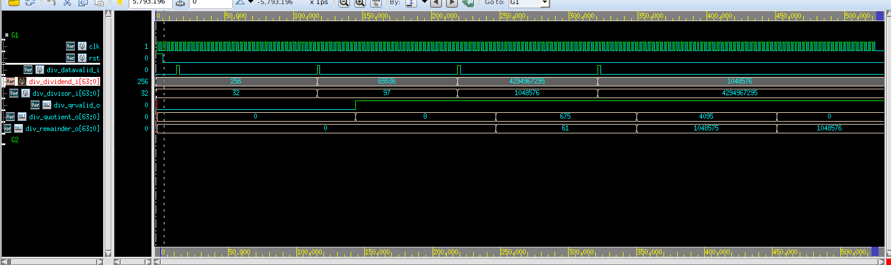
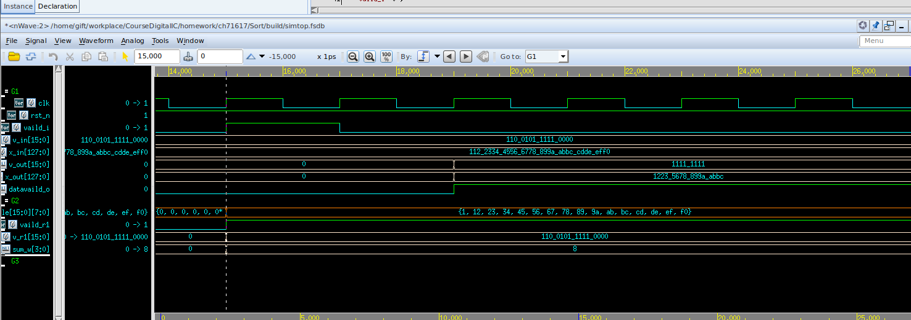
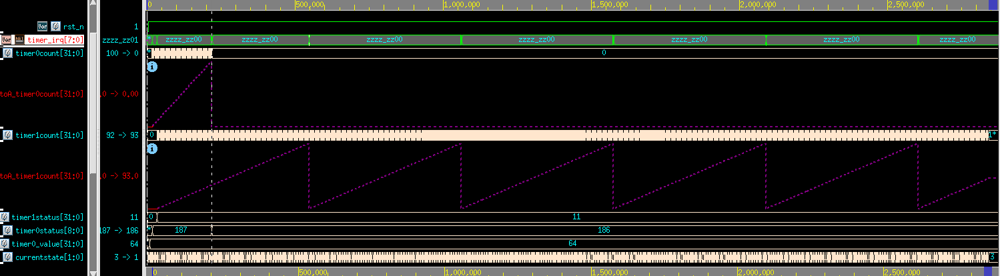

<!--
 * @Author: WenJiaBao-2022E8020282071
 * @Date: 2022-12-13 13:59:11
 * @LastEditTime: 2022-12-13 14:21:42
 * @Description: 
 * 
 * Copyright (c) 2022 by WenJiaBao wenjiabao0919@163.com, All Rights Reserved. 
-->

# <p align="middle">高等数字集成电路作业-第十七十六七章  </p>  
<p align="right">Author: 文家宝</p>  


## 1. 基于VerilogHDL进行逻辑电路设计
<br>

### 1. **无符号除法器**  
设计一个时序逻辑电路，计算32位无符号数除法。对于输入a和b，计算a除以b得到的商q和余数r。例如：

- 输入a = 256，b = 32，输出q = 8，r = 0

- 输入a = 65536，b = 97，输出q = 675，r = 61

- 输入a = 4294967295，b = 1048576，输出q = 4095，r = 1048575

- 输入a = 1048576，b = 4294967295，输出q = 0，r = 1048576

顶层模块名为div_u32，输入输出功能定义：

模块输入输出功能定义：       

| <p align="middle">名称</p>  | <p align="middle">方向</p>  |  <p align="middle">位宽</p> | <p align="middle">描述</p>  |   
|---|---|---|---|
|  <p align="middle">clk  </p> | <p align="middle">Input  </p>  |  <p align="middle">1  </p> | <p align="middle">系统时钟  </p>  |  
|  <p align="middle">rst_n  </p> | <p align="middle">Input  </p>  |  <p align="middle">1 </p> | <p align="middle">系统异步复位，低电平有效  </p>  |  
|  <p align="middle">vld_in  </p> | <p align="middle">Input  </p>  |  <p align="middle">1  </p> | <p align="middle">输入数据有效指示  </p>  |  
|  <p align="middle">x  </p> | <p align="middle">Output  </p>  |  <p align="middle">32  </p> | <p align="middle">输入被除数  </p>  |  
|  <p align="middle">b  </p> | <p align="middle">Output  </p>  |  <p align="middle">32  </p> | <p align="middle">输入除数  </p>  | 
|  <p align="middle">vld_out  </p> | <p align="middle">Output  </p>  |  <p align="middle">1  </p> | <p align="middle">输出数据有效指示  </p>  |  
|  <p align="middle">q  </p> | <p align="middle">Output  </p>  |  <p align="middle">32  </p> | <p align="middle">输出商 </p>  |  
|  <p align="middle">r  </p> | <p align="middle">Output  </p>  |  <p align="middle">32  </p> | <p align="middle">输出余数 </p>  |  

|  <p align="middle">

**实现思路：**
```verilog
always @(posedge clk) begin
    if (rst) begin
    	div_doing_o <= 1'b0;
    end
    /*除法结果输出后需要将div_doing置零*/
    else if (div_qrvalid_o) begin
      	div_doing_o <= 1'b0;
    end
    /*握手成功后，也就是除法器接受输入的数据后需要把div_doing置高*/
    else if(div_datavalid_i) begin
      	div_doing_o <= 1'b1;
    end
end

always @(posedge clk ) begin
	if (rst) begin
    	div_quotient_o 	<= 1'b0;
		div_remainder_o	<= 0;
		div_qrvalid_o	<=0;
    end
	else if (div_ready)begin
		div_quotient_o 	<= 1'b0;
		div_remainder_o	<= 0;
		div_qrvalid_o	<=0;
	end
	else if(div_qrvalid_r)begin
		div_quotient_o 	<= div_quotiento_r;
		div_remainder_o	<= div_remaindero_r;
		div_qrvalid_o	<= div_qrvalid_r;
	end
end

genvar div_m_var;
//get valid input data
always @ (posedge clk ) begin
	if (rst) begin
		div_remainder_r	[0] <= {2*WIDTH+1{1'b0}};
		div_divisor_r  	[0] <= {2*WIDTH  {1'b0}};
		div_quotient_r 	[0] <= {  WIDTH  {1'b0}};
		div_data_valid_r[0] <=            1'b0  ;
	end else if (div_datavalid_i) begin
		if (|div_divisor_i) begin//if div_divisor_i is not zero
			div_remainder_r	[0] 	<= (div_dividend_i<<1) - (div_divisor_i<<WIDTH);
			div_divisor_r  	[0] 	<= div_divisor_i<<WIDTH;
			div_quotient_r 	[0] 	<= {  WIDTH  {1'b0}};
			div_data_valid_r[0] 	<=            1'b1  ;
		end else begin
			div_remainder_r	[0] 	<= {2*WIDTH+1{1'b0}};
			div_divisor_r  	[0] 	<= {2*WIDTH  {1'b0}};
			div_quotient_r 	[0] 	<= {  WIDTH  {1'b0}};
			div_data_valid_r[0] 	<=            1'b0  ;
		end
	end else begin
		div_remainder_r	[0]		<= {2*WIDTH+1{1'b0}};
		div_divisor_r  	[0]		<= {2*WIDTH  {1'b0}};
		div_quotient_r 	[0]		<= {  WIDTH  {1'b0}};
		div_data_valid_r[0]		<=            1'b0  ;
	end
end
//if n<0, n=n+d; n<<1, n=n-q; \
//else n<<1, n=n-q;
generate
for (div_m_var=1;div_m_var<WIDTH;div_m_var=div_m_var+1) begin: calculate_cycle
	always @ (posedge clk ) begin
		if (rst) begin
			div_remainder_r[div_m_var] 	<= {2*WIDTH+1{1'b0}};
			div_divisor_r  [div_m_var] 	<= {2*WIDTH  {1'b0}};
			div_quotient_r [div_m_var] 	<= {  WIDTH  {1'b0}};
			div_data_valid_r[div_m_var] <=            1'b0  ;
		end else if (div_data_valid_r[div_m_var-1]) begin
			if (div_remainder_r[div_m_var-1][2*WIDTH]) begin//restore 
				div_remainder_r[div_m_var] <= ((div_remainder_r[div_m_var-1]+div_divisor_r[div_m_var-1])<<1) - div_divisor_r[div_m_var-1];
				div_divisor_r  [div_m_var] <= div_divisor_r  [div_m_var-1];
				div_quotient_r [div_m_var] <= div_quotient_r [div_m_var-1]<<1 ;
				div_data_valid_r[div_m_var] <= div_data_valid_r[div_m_var-1];
			end else begin//not restore 
				div_remainder_r[div_m_var] <= (div_remainder_r[div_m_var-1]<<1) - div_divisor_r[div_m_var-1];
				div_divisor_r  [div_m_var] <= div_divisor_r  [div_m_var-1];
				div_quotient_r [div_m_var] <= (div_quotient_r [div_m_var-1]<<1) + 1'b1;
				div_data_valid_r[div_m_var] <= div_data_valid_r[div_m_var-1];
			end
		end else begin
			div_remainder_r[div_m_var] <= div_remainder_r[div_m_var-1];
			div_divisor_r  [div_m_var] <= div_divisor_r  [div_m_var-1];
			div_quotient_r [div_m_var] <= div_quotient_r [div_m_var-1];
			div_data_valid_r[div_m_var] <= div_data_valid_r[div_m_var-1];
		end
	end
end
endgenerate

always @ (posedge clk ) begin
	if (rst) begin
		div_remaindero_r <= {WIDTH{1'b0}};
		div_remaindero_r  <= {WIDTH{1'b0}};
		div_qrvalid_r  <=        1'b0  ;
	end else if (div_data_valid_r[WIDTH-1]) begin
		if (div_remainder_r[WIDTH-1][2*WIDTH]) begin
			div_remaindero_r <= (div_remainder_r[WIDTH-1]+div_divisor_r[WIDTH-1])>>WIDTH;
			div_quotiento_r  <= div_quotient_r [WIDTH-1]<<1;
			div_qrvalid_r  <= div_data_valid_r[WIDTH-1];
		end else begin
			div_remaindero_r <= div_remainder_r[WIDTH-1]>>WIDTH;
			div_quotiento_r  <= (div_quotient_r [WIDTH-1]<<1) + 1'b1;
			div_qrvalid_r  <= div_data_valid_r[WIDTH-1];
		end
	end else begin
			div_qrvalid_r  <= div_data_valid_r[WIDTH-1];
	end
end


```
仿真截图：  
  
 
逻辑综合：     
采用smic180nm工艺库PVT环境为SS工艺角进行综合，时钟最高频率为434Mhz，采用最小面积约束进行综合
```
#==================================Env Vars===================================
set RST_NAME				rst_n
set CLK_NAME				clk

set CLK_PERIOD_I			10
set CLK_PERIOD            	[expr $CLK_PERIOD_I*0.95]
set CLK_SKEW              	[expr $CLK_PERIOD*0.05]
set CLK_SOURCE_LATENCY   	[expr $CLK_PERIOD*0.1]    
set CLK_NETWORK_LATENCY   	[expr $CLK_PERIOD*0.1]  
set CLK_TRAN             	[expr $CLK_PERIOD*0.01]

set INPUT_DELAY_MAX         [expr $CLK_PERIOD*0.4]
set INPUT_DELAY_MIN           0
set OUTPUT_DELAY_MAX        [expr $CLK_PERIOD*0.4]
set OUTPUT_DELAY_MIN          0

set MAX_FANOUT             6
set MAX_TRAN               5
set MAX_CAP                1.5

set ALL_INPUT_EX_CLK [remove_from_collection [all_inputs] [get_ports $CLK_NAME]]
#==================================Define Design Environment=========================
#GUIDANCE: use the default
set_max_area 0
#set_max_transition  $MAX_TRAN     [current_design]
#set_max_fanout      $MAX_FANOUT   [current_design]
#set_max_capacitance $MAX_CAP      [current_design]

#============================= Set Design Constraints=========================
#--------------------------------Clock and Reset Definition----------------------------
set_drive 0 [get_ports $CLK_NAME]
create_clock -name $CLK_NAME -period $CLK_PERIOD [get_ports $CLK_NAME]
set_dont_touch_network [get_ports $CLK_NAME]

set_clock_uncertainty $CLK_SKEW [get_clocks $CLK_NAME]
set_clock_transition  $CLK_TRAN [all_clocks]
set_clock_latency -source $CLK_SOURCE_LATENCY [get_clocks $CLK_NAME]
set_clock_latency -max $CLK_NETWORK_LATENCY [get_clocks $CLK_NAME]
#rst_ports
set_drive 0            				[get_ports $RST_NAME]
set_dont_touch_network 				[get_ports $RST_NAME]
set_false_path -from   				[get_ports $RST_NAME] 
set_ideal_network -no_propagate     [get_ports $RST_NAME]


#--------------------------------I/O Constraint-----------------------------
set_input_delay   -max $INPUT_DELAY_MAX   -clock $CLK_NAME   $ALL_INPUT_EX_CLK
set_input_delay   -min $INPUT_DELAY_MIN   -clock $CLK_NAME   $ALL_INPUT_EX_CLK -add
set_output_delay  -max $OUTPUT_DELAY_MAX  -clock $CLK_NAME   [all_outputs]
set_output_delay  -min $OUTPUT_DELAY_MIN  -clock $CLK_NAME   [all_outputs] -add
set_load  0.2 	[all_outputs]	
  Point                                                   Incr       Path
****************************************
Report : timing
        -path full
        -delay max
        -max_paths 1
Design : top
Version: L-2016.03-SP1
Date   : Tue Dec  6 22:35:09 2022
****************************************

 # A fanout number of 1000 was used for high fanout net computations.

Operating Conditions: ss_1v62_125c   Library: ss_1v62_125c
Wire Load Model Mode: top

  Startpoint: div_remainder_r_reg_0__91_
              (rising edge-triggered flip-flop clocked by clk)
  Endpoint: div_remainder_r_reg_1__128_
            (rising edge-triggered flip-flop clocked by clk)
  Path Group: clk
  Path Type: max

  Point                                                   Incr       Path
  --------------------------------------------------------------------------
  clock clk (rise edge)                                   0.00       0.00
  clock network delay (ideal)                             1.90       1.90
  div_remainder_r_reg_0__91_/CK (DFFTRX1M)                0.00 #     1.90 r
  div_remainder_r_reg_0__91_/Q (DFFTRX1M)                 0.57       2.47 f
  DP_OP_664_308_2961/I1[91] (top_DP_OP_664_308_2961_1)
                                                          0.00       2.47 f
  DP_OP_664_308_2961/U1616/Y (NOR2X1M)                    0.21       2.68 r
  DP_OP_664_308_2961/U1613/Y (OAI21XLM)                   0.14       2.82 f
  DP_OP_664_308_2961/U1611/Y (AOI21XLM)                   0.28       3.10 r
  DP_OP_664_308_2961/U1545/Y (OAI21XLM)                   0.15       3.25 f
  DP_OP_664_308_2961/U1543/Y (AOI21XLM)                   0.19       3.44 r
  DP_OP_664_308_2961/U1541/Y (OAI21X1M)                   0.87       4.31 f
  DP_OP_664_308_2961/U1413/Y (AOI21XLM)                   0.36       4.67 r
  DP_OP_664_308_2961/U1396/Y (XOR2XLM)                    0.18       4.85 r
  DP_OP_664_308_2961/U924/Y (MX2XLM)                      0.26       5.11 r
  DP_OP_664_308_2961/U217/Y (NAND2XLM)                    0.18       5.29 f
  DP_OP_664_308_2961/U195/Y (OAI21XLM)                    0.28       5.57 r
  DP_OP_664_308_2961/U155/Y (AOI21XLM)                    0.19       5.76 f
  DP_OP_664_308_2961/U139/Y (OAI21XLM)                    0.28       6.04 r
  DP_OP_664_308_2961/U123/Y (AOI21XLM)                    0.20       6.24 f
  DP_OP_664_308_2961/U111/Y (OAI21XLM)                    0.22       6.46 r
  DP_OP_664_308_2961/U109/Y (AOI21XLM)                    0.13       6.59 f
  DP_OP_664_308_2961/U103/Y (OAI21XLM)                    0.31       6.90 r
  DP_OP_664_308_2961/U95/Y (AOI21XLM)                     0.23       7.14 f
  DP_OP_664_308_2961/U89/Y (OAI21XLM)                     0.31       7.45 r
  DP_OP_664_308_2961/U2001/Y (AOI21XLM)                   0.25       7.70 f
  DP_OP_664_308_2961/U75/Y (OAI21X1M)                     0.23       7.93 r
  DP_OP_664_308_2961/U67/Y (AOI21X1M)                     0.20       8.13 f
  DP_OP_664_308_2961/U61/Y (OAI21X1M)                     0.22       8.35 r
  DP_OP_664_308_2961/U53/Y (AOI21X1M)                     0.20       8.55 f
  DP_OP_664_308_2961/U47/Y (OAI21X1M)                     0.22       8.77 r
  DP_OP_664_308_2961/U39/Y (AOI21X1M)                     0.20       8.97 f
  DP_OP_664_308_2961/U33/Y (OAI21X1M)                     0.22       9.19 r
  DP_OP_664_308_2961/U25/Y (AOI21X1M)                     0.20       9.39 f
  DP_OP_664_308_2961/U19/Y (OAI21X1M)                     0.22       9.61 r
  DP_OP_664_308_2961/U11/Y (AOI21X1M)                     0.20       9.81 f
  DP_OP_664_308_2961/U5/Y (OAI21X1M)                      0.20      10.00 r
  DP_OP_664_308_2961/U3/CO (ADDFX2M)                      0.34      10.35 r
  DP_OP_664_308_2961/U1/Y (XOR2XLM)                       0.08      10.43 f
  DP_OP_664_308_2961/O1[128] (top_DP_OP_664_308_2961_1)
                                                          0.00      10.43 f
  U25278/Y (AO22XLM)                                      0.34      10.77 f
  div_remainder_r_reg_1__128_/D (DFFQX1M)                 0.00      10.77 f
  data arrival time                                                 10.77

  clock clk (rise edge)                                   9.50       9.50
  clock network delay (ideal)                             1.90      11.40
  clock uncertainty                                      -0.47      10.92
  div_remainder_r_reg_1__128_/CK (DFFQX1M)                0.00      10.92 r
  library setup time                                     -0.16      10.77
  data required time                                                10.77
  --------------------------------------------------------------------------
  data required time                                                10.77
  data arrival time                                                -10.77
  --------------------------------------------------------------------------
  slack (MET)                                                        0.00

Total Dynamic Power    = 185.3276 mW  (100%)

Cell Leakage Power     =  61.4446 uW


                 Internal         Switching           Leakage            Total
Power Group      Power            Power               Power              Power   (   %    )  Attrs
--------------------------------------------------------------------------------------------------
io_pad             0.0000            0.0000            0.0000            0.0000  (   0.00%)
memory             0.0000            0.0000            0.0000            0.0000  (   0.00%)
black_box          0.0000            0.0000            0.0000            0.0000  (   0.00%)
clock_network      0.0000            0.0000            0.0000            0.0000  (   0.00%)
register         169.2298            1.2697        3.0614e+07          170.5291  (  91.99%)
sequential         0.0000            0.0000            0.0000            0.0000  (   0.00%)
combinational      7.8444            6.9825        3.0831e+07           14.8580  (   8.01%)
--------------------------------------------------------------------------------------------------
Total            177.0742 mW         8.2523 mW     6.1445e+07 pW       185.3871 mW
1

 
 
****************************************
Report : area
Design : top
Version: L-2016.03-SP1
Date   : Tue Dec  6 22:35:09 2022
****************************************

Library(s) Used:

    ss_1v62_125c (File: /opt/PDKs/smic_180/SM00LB501-FE-00000-r0p0-00rel0/aci/sc-m/synopsys/ss_1v62_125c.db)

Number of ports:                        33545
Number of nets:                        142541
Number of cells:                       117818
Number of combinational cells:          94867
Number of sequential cells:             22886
Number of macros/black boxes:               0
Number of buf/inv:                      20430
Number of references:                     126

Combinational area:            1066994.505522
Buf/Inv area:                   134791.863543
Noncombinational area:          752007.454430
Macro/Black Box area:                0.000000
Net Interconnect area:      undefined  (No wire load specified)

Total cell area:               1819001.959951
Total area:                 undefined
```


### 2. 数据排序  
设计一个时序逻辑电路，根据输入128位向量与对应16位有效指示信号进行重排序并输出。128位向量x与对应16位有效指示信号v的形式如下：

顶层模块名为sort_32_u8，输入输出功能定义：
       
信号v[i]对应向量x的[i*8+7:i*8]范围，其中i = 0 ~ 15。信号v[i]为1表示对应8位数据有效，否则无效。
需要将v[i]为1对应的数据移到低位输出，相对顺序保持不变；而v[i]为0对应数据清零移到高位输出。指示信号v也类似处理。例如：  

输入v为**16'b0110010111110000**
输入x为**128'h01_12_23_34_45_56_67_78_89_9A_AB_BC_CD_DE_EF_F0**输出v为**16'b0000000011111111**

输出x为**128'h00_00_00_00_00_00_00_00_12_23_56_78_89_9A_AB_BC**
例子说明：输入v当中有8位为1，对应8位数据从高到低依次为**8'h12、8'h23、8'h56、8'h78、8'h89、8'h9A、8'hAB、8'hBC**；输出v将8位1移到最低8位，高位均为0，输出x最低64位为**64'h12_23_56_78_89_9A_AB_BC**，高64位均为0。


 

模块输入输出功能定义：       

| <p align="middle">名称</p>  | <p align="middle">方向</p>  |  <p align="middle">位宽</p> | <p align="middle">描述</p>  |   
|---|---|---|---|
|  <p align="middle">clk  </p> | <p align="middle">Input  </p>  |  <p align="middle">1  </p> | <p align="middle">系统时钟  </p>  |  
|  <p align="middle">rst_n </p> | <p align="middle">Input  </p>  |  <p align="middle">1 </p> | <p align="middle">系统异步复位，低电平有效  </p>  |  
|  <p align="middle">v_in  </p> | <p align="middle">Input  </p>  |  <p align="middle">16  </p> | <p align="middle">输入数据有效指示  </p>  | 
|  <p align="middle">x_in  </p> | <p align="middle">Input  </p>  |  <p align="middle">128 </p> | <p align="middle">输入数据向量</p>  |
|  <p align="middle">v_out  </p> | <p align="middle">Output  </p>  |  <p align="middle">16  </p> | <p align="middle">输出数据有效指示 </p>  |
|  <p align="middle">x_out  </p> | <p align="middle">Output  </p>  |  <p align="middle">128  </p> | <p align="middle">输出数据向量</p>  |
**实现思路一：数据排序**
```verilog
 /*********************Stage1*******************************/
    generate
        for(i=0;i<16;i=i+1)begin:st1loop
            always @(posedge clk or negedge rst_n) begin
                if(!rst_n)begin
                    regfile[i] <= 'b0;
                end else if(vaild_i)begin
                    regfile[i] <= x_in[i*8+7:i*8];
                end else begin
                    regfile[i] <= regfile[i];
                end
            end
        end
    endgenerate
    always @(posedge clk or negedge rst_n) begin
        if(!rst_n)begin
            v_r1    <= 'b0;

            vaild_r1 <= 'b0;
        end else if(vaild_i)begin
            v_r1    <= v_in;
            vaild_r1 <= vaild_i;
        end
    end
    wire [3:0]  sum_w;
    wire co;
    wire [15:0] v_w1 ;
    sum16   sum16_u0(  .in1(v_r1[0]),.in2(v_r1[1]),.in3(v_r1[2]),.in4(v_r1[3]),.in5(v_r1[4]),
                    .in6(v_r1[5]),.in7(v_r1[6]),.in8(v_r1[7]),.in9(v_r1[8]),.in10(v_r1[9]),
                    .in11(v_r1[10]),.in12(v_r1[11]),.in13(v_r1[12]),.in14(v_r1[13]),.in15(v_r1[14]),
                    .in16(v_r1[15]),.co(co),.sum(sum_w)
                );

    decode16_5 decode16_5_u0(.in({co,sum_w}),.out(v_w1));

    wire [15:0]onehot[15:0];
    wire [15:0]temp[15:0];
    assign onehot   [0] =    v_r1 & (~v_r1+1);
    assign temp     [0] =    v_r1&(~onehot[0]);
    generate
        for (i= 1 ; i<16 ; i=i+1)begin:st1loop2
            assign onehot [i]=(temp[i-1]) & (~(temp[i-1])+1);
            assign temp [i]  = temp[i-1]&(~onehot[i]);    
        end
    endgenerate
    wire [3:0]  addr_w [15:0];
    generate
        for(i=0;i<16;i=i+1)begin:onehotdecz
            onehotdec onehotdec_u(.onehot(onehot[i]),.dec(addr_w[i]));
        end
    endgenerate
/*********************Stage2*******************************/
    reg [3:0]  addr_r2 [15:0];
    reg [15:0] v_r2 ;
    reg vaild_r2;
    generate
        for(i=0;i<16;i=i+1)begin:st2loop
            always @(posedge clk or negedge rst_n) begin
                if(!rst_n)begin
                    addr_r2[i]     <=  'b0;
                end else begin
                    addr_r2[i]     <=  addr_w[i];
                end
            end
        end
    endgenerate
    always @(posedge clk ) begin
        if(!rst_n)begin
            v_r2           <=  'b0;
            vaild_r2       <=  'b0;
        end else begin
            v_r2           <=  v_w1;
            vaild_r2       <=  vaild_r1;
        end
    end
    wire [7:0] data_w [15:0];
    generate
        for (i =0 ;i<16 ;i=i+1 ) begin:st2loop2
            assign data_w[i] = v_r2[i] ? regfile[addr_r2[i]] : 'b0;
        end
    endgenerate
    /*********************Stage3*******************************/
    reg [7:0]  datar [15:0];
    
    generate
        for ( i=0 ;i<16;i=i+1 ) begin:st3loop
            always @(posedge clk or negedge rst_n) begin
                if(!rst_n)begin
                    datar[i] <=  'b0;
                end else begin
                    datar[i] <=  data_w[i];
                end
            end  
        end
    endgenerate
    always @(posedge clk ) begin
        if(!rst_n)begin
            v_out           <=  'b0;
            datavaild_o     <=  'b0;
        end else begin
            v_out           <=  v_r2;
            datavaild_o     <=  vaild_r2;
        end
    end
    assign x_out = {datar[15],datar[14],datar[13],datar[12],datar[11],
                    datar[10],datar[9],datar[8],datar[7],datar[6],
                    datar[5],datar[4],datar[3],datar[2],datar[1],datar[0]}

```
仿真截图：  


逻辑综合：     
采用smic180nm工艺库PVT环境为SS工艺角进行综合，时钟最高频率为，采用最小面积约束进行综合
```

#==================================Env Vars===================================
set RST_NAME				rst_n
set CLK_NAME				clk

set CLK_PERIOD_I			2.5
set CLK_PERIOD            	[expr $CLK_PERIOD_I*0.95]
set CLK_SKEW              	[expr $CLK_PERIOD*0.05]
set CLK_SOURCE_LATENCY   	[expr $CLK_PERIOD*0.1]    
set CLK_NETWORK_LATENCY   	[expr $CLK_PERIOD*0.1]  
set CLK_TRAN             	[expr $CLK_PERIOD*0.01]

set INPUT_DELAY_MAX         [expr $CLK_PERIOD*0.4]
set INPUT_DELAY_MIN           0
set OUTPUT_DELAY_MAX        [expr $CLK_PERIOD*0.4]
set OUTPUT_DELAY_MIN          0

set MAX_FANOUT             6
set MAX_TRAN               5
set MAX_CAP                1.5

set ALL_INPUT_EX_CLK [remove_from_collection [all_inputs] [get_ports $CLK_NAME]]
#==================================Define Design Environment=========================
#GUIDANCE: use the default
set_max_area 0
#set_max_transition  $MAX_TRAN     [current_design]
#set_max_fanout      $MAX_FANOUT   [current_design]
#set_max_capacitance $MAX_CAP      [current_design]

#============================= Set Design Constraints=========================
#--------------------------------Clock and Reset Definition----------------------------
set_drive 0 [get_ports $CLK_NAME]
create_clock -name $CLK_NAME -period $CLK_PERIOD [get_ports $CLK_NAME]
set_dont_touch_network [get_ports $CLK_NAME]

set_clock_uncertainty $CLK_SKEW [get_clocks $CLK_NAME]
set_clock_transition  $CLK_TRAN [all_clocks]
set_clock_latency -source $CLK_SOURCE_LATENCY [get_clocks $CLK_NAME]
set_clock_latency -max $CLK_NETWORK_LATENCY [get_clocks $CLK_NAME]
#rst_ports
set_drive 0            				[get_ports $RST_NAME]
set_dont_touch_network 				[get_ports $RST_NAME]
set_false_path -from   				[get_ports $RST_NAME] 
set_ideal_network -no_propagate     [get_ports $RST_NAME]


#--------------------------------I/O Constraint-----------------------------
set_input_delay   -max $INPUT_DELAY_MAX   -clock $CLK_NAME   $ALL_INPUT_EX_CLK
set_input_delay   -min $INPUT_DELAY_MIN   -clock $CLK_NAME   $ALL_INPUT_EX_CLK -add
set_output_delay  -max $OUTPUT_DELAY_MAX  -clock $CLK_NAME   [all_outputs]
set_output_delay  -min $OUTPUT_DELAY_MIN  -clock $CLK_NAME   [all_outputs] -add
set_load  0.2 	[all_outputs]	
****************************************
Report : timing
        -path full
        -delay max
        -max_paths 1
Design : top
Version: L-2016.03-SP1
Date   : Tue Dec  6 23:07:16 2022
****************************************

Operating Conditions: ss_1v62_125c   Library: ss_1v62_125c
Wire Load Model Mode: top

  Startpoint: v_r1_reg_1_
              (rising edge-triggered flip-flop clocked by clk)
  Endpoint: addr_r2_reg_14__1_
            (rising edge-triggered flip-flop clocked by clk)
  Path Group: clk
  Path Type: max

  Point                                                   Incr       Path
  --------------------------------------------------------------------------
  clock clk (rise edge)                                   0.00       0.00
  clock network delay (ideal)                             1.90       1.90
  v_r1_reg_1_/CK (DFFRHQX8M)                              0.00       1.90 r
  v_r1_reg_1_/Q (DFFRHQX8M)                               0.30       2.20 r
  U407/Y (CLKINVX8M)                                      0.09       2.29 f
  add_x_1/A[1] (top_DW01_inc_17)                          0.00       2.29 f
  add_x_1/U124/Y (XOR2X4M)                                0.18       2.47 f
  add_x_1/SUM[1] (top_DW01_inc_17)                        0.00       2.47 f
  U602/Y (NAND2X3M)                                       0.09       2.56 r
  U568/Y (INVX3M)                                         0.07       2.63 f
  U404/Y (NOR2X6M)                                        0.13       2.76 r
  U403/Y (INVX8M)                                         0.06       2.82 f
  add_x_2/A[1] (top_DW01_inc_19)                          0.00       2.82 f
  add_x_2/U91/Y (NAND2X8M)                                0.09       2.91 r
  add_x_2/U90/Y (INVX8M)                                  0.06       2.97 f
  add_x_2/U114/Y (NAND2X12M)                              0.07       3.04 r
  add_x_2/U108/Y (INVX4M)                                 0.05       3.09 f
  add_x_2/U110/Y (NAND2X4M)                               0.07       3.16 r
  add_x_2/U117/Y (XNOR2X8M)                               0.13       3.29 r
  add_x_2/SUM[5] (top_DW01_inc_19)                        0.00       3.29 r
  U393/Y (INVX4M)                                         0.06       3.35 f
  U390/Y (NOR2X6M)                                        0.13       3.48 r
  U387/Y (INVX4M)                                         0.07       3.55 f
  U386/Y (NAND2X8M)                                       0.09       3.64 r
  add_x_3/A[5] (top_DW01_inc_21)                          0.00       3.64 r
  add_x_3/U103/Y (NAND2X8M)                               0.09       3.73 f
  add_x_3/U84/Y (CLKINVX6M)                               0.07       3.80 r
  add_x_3/U83/Y (NAND3X6M)                                0.12       3.93 f
  add_x_3/U99/Y (INVX3M)                                  0.08       4.00 r
  add_x_3/U77/Y (AND2X4M)                                 0.17       4.17 r
  add_x_3/U29/Y (XNOR2X8M)                                0.12       4.29 r
  add_x_3/SUM[9] (top_DW01_inc_21)                        0.00       4.29 r
  U368/Y (NAND2X4M)                                       0.10       4.39 f
  U366/Y (NAND2X4M)                                       0.10       4.49 r
  add_x_4/A[9] (top_DW01_inc_23)                          0.00       4.49 r
  add_x_4/U74/Y (NAND2X5M)                                0.10       4.59 f
  add_x_4/U73/Y (NOR2X8M)                                 0.11       4.70 r
  add_x_4/U68/Y (INVX2M)                                  0.08       4.78 f
  add_x_4/U67/Y (CLKINVX4M)                               0.10       4.88 r
  add_x_4/U65/Y (AND2X2M)                                 0.18       5.05 r
  add_x_4/U62/Y (XNOR2X2M)                                0.13       5.19 r
  add_x_4/SUM[11] (top_DW01_inc_23)                       0.00       5.19 r
  U355/Y (NAND2X2M)                                       0.14       5.32 f
  U508/Y (NAND2X4M)                                       0.11       5.44 r
  U764/CO (ADDHX4M)                                       0.18       5.62 r
  U346/Y (NAND2X3M)                                       0.10       5.72 f
  U501/Y (XNOR2X4M)                                       0.15       5.86 f
  U497/Y (CLKAND2X6M)                                     0.20       6.07 f
  I_147/Y (INVX4M)                                        0.06       6.13 r
  U336/Y (NAND2X3M)                                       0.09       6.22 f
  U780/CO (ADDHX4M)                                       0.19       6.41 f
  U733/S (ADDHX4M)                                        0.17       6.58 f
  C2718/Y (AND2X6M)                                       0.20       6.78 f
  I_178/Y (CLKINVX6M)                                     0.05       6.83 r
  U475/Y (NAND2X4M)                                       0.09       6.92 f
  U703/CO (ADDHX4M)                                       0.17       7.09 f
  U787/Y (XOR2X4M)                                        0.17       7.26 f
  U664/Y (NAND2X4M)                                       0.09       7.35 r
  C2797/Y (AND2X8M)                                       0.17       7.52 r
  U316/Y (INVX6M)                                         0.06       7.57 f
  U759/Y (XOR2X8M)                                        0.16       7.73 f
  U682/Y (NAND2X4M)                                       0.07       7.80 r
  U611/Y (AND2X4M)                                        0.20       8.00 r
  I_257/Y (CLKINVX6M)                                     0.07       8.07 f
  U658/Y (XNOR2X8M)                                       0.14       8.22 f
  U614/Y (INVX8M)                                         0.06       8.28 r
  U304/Y (NAND2X4M)                                       0.07       8.34 f
  C2925/Y (AND2X6M)                                       0.17       8.51 f
  U452/Y (INVX2M)                                         0.08       8.59 r
  U785/Y (XOR2X4M)                                        0.13       8.72 r
  C2973/Y (AND2X6M)                                       0.19       8.91 r
  I_305/Y (CLKINVX4M)                                     0.06       8.98 f
  U705/Y (NAND2X4M)                                       0.07       9.05 r
  U639/Y (XOR2X4M)                                        0.14       9.19 r
  C3037/Y (CLKAND2X12M)                                   0.24       9.43 r
  U671/Y (NOR2X12M)                                       0.06       9.49 f
  U706/Y (NAND2X8M)                                       0.07       9.56 r
  U653/Y (NAND2X8M)                                       0.08       9.65 f
  U641/Y (XNOR2X8M)                                       0.15       9.80 f
  U640/Y (NAND2X8M)                                       0.08       9.88 r
  U437/Y (NAND2X6M)                                       0.08       9.96 f
  U430/Y (INVX8M)                                         0.10      10.06 r
  U278/Y (CLKNAND2X12M)                                   0.11      10.17 f
  U689/Y (NAND2X8M)                                       0.09      10.26 r
  U731/Y (XOR2X8M)                                        0.12      10.38 r
  U276/Y (NOR2X4M)                                        0.08      10.46 f
  onehotdecz_14__onehotdec_u/onehot[15] (onehotdec_2)     0.00      10.46 f
  onehotdecz_14__onehotdec_u/U8/Y (INVX2M)                0.07      10.53 r
  onehotdecz_14__onehotdec_u/U6/Y (NAND2X2M)              0.10      10.63 f
  onehotdecz_14__onehotdec_u/U3/Y (NAND2X2M)              0.10      10.72 r
  onehotdecz_14__onehotdec_u/dec[1] (onehotdec_2)         0.00      10.72 r
  addr_r2_reg_14__1_/D (DFFRHQX2M)                        0.00      10.72 r
  data arrival time                                                 10.72

  clock clk (rise edge)                                   9.50       9.50
  clock network delay (ideal)                             1.90      11.40
  clock uncertainty                                      -0.47      10.92
  addr_r2_reg_14__1_/CK (DFFRHQX2M)                       0.00      10.92 r
  library setup time                                     -0.20      10.73
  data required time                                                10.73
  --------------------------------------------------------------------------
  data required time                                                10.73
  data arrival time                                                -10.72
  --------------------------------------------------------------------------
  slack (MET)                                                        0.01

Total Dynamic Power    =   3.4598 mW  (100%)

Cell Leakage Power     =   2.3131 uW


                 Internal         Switching           Leakage            Total
Power Group      Power            Power               Power              Power   (   %    )  Attrs
--------------------------------------------------------------------------------------------------
io_pad             0.0000            0.0000            0.0000            0.0000  (   0.00%)
memory             0.0000            0.0000            0.0000            0.0000  (   0.00%)
black_box          0.0000            0.0000            0.0000            0.0000  (   0.00%)
clock_network      0.0000            0.0000            0.0000            0.0000  (   0.00%)
register           2.9224            0.2389        4.8663e+05            3.1617  (  91.32%)
sequential         0.0000            0.0000            0.0000            0.0000  (   0.00%)
combinational      0.1816            0.1170        1.8264e+06            0.3004  (   8.68%)
--------------------------------------------------------------------------------------------------
Total              3.1039 mW         0.3559 mW     2.3131e+06 pW         3.4621 mW
1
   
****************************************
Report : area
Design : top
Version: L-2016.03-SP1
Date   : Tue Dec  6 23:07:16 2022
****************************************

Library(s) Used:

    ss_1v62_125c (File: /opt/PDKs/smic_180/SM00LB501-FE-00000-r0p0-00rel0/aci/sc-m/synopsys/ss_1v62_125c.db)

Number of ports:                          803
Number of nets:                          4232
Number of cells:                         3676
Number of combinational cells:           3280
Number of sequential cells:               373
Number of macros/black boxes:               0
Number of buf/inv:                        431
Number of references:                      97

Combinational area:              45326.488932
Buf/Inv area:                     3336.703949
Noncombinational area:           17737.216377
Macro/Black Box area:                0.000000
Net Interconnect area:      undefined  (No wire load specified)

Total cell area:                 63063.705309
Total area:                 undefined

```


<br/>

### 3. **APB定时控制器**  
设计一个基于APB从接口的定时控制器，具有如下基本功能：
- 多达8个可编程定时器
- 定时器宽度可设：8至32位
- 支持两种运行模式：自由运行和自定义运行
- 支持定时器的独立计时
- 每个中断可配置极性：低电平（下降沿），高电平（上升沿）
- 单个或组合中断输出标志的可配置选项

使用流程：
- 初始化（通过寄存器初始化定时器，N在1~8范围内）
1. 通过向定时器使能位写“0”来禁用定时器，即timer_en输出信号被置为低电平
2. 通过向定时器模式位写“0”或“1”来确定定时器模式（自由运行和自定义运行）
3. 通过向定时器中断屏蔽位写“0”或“1”设置中断屏蔽或不屏蔽
- 将定时器计数器值加载到寄存器中（N在1~8范围内）
- 通过给寄存器使能位写“1”来启动定时器

APB接口数据大小固定为32-bit，APB接口地址范围为0x000 – 0xFFC。通过APB接口实现基本的数据读写操作。

顶层模块名为timer_apb，输入输出功能定义：


模块输入输出功能定义：     
```  
名称	方向	位宽	描述
pclk	I	1	系统时钟
presetn	I	1	系统异步复位，低电平有效
penable	I	1	使能
psel	I	1	从设备选择有效
paddr	I	32	读写地址
pwrite	I	1	写有效
pwdata	I	32	写数据
prdata	O	32	读数据
timer_irq	O	8	定时器中断输出
```

**实现思路**
```verilog
    //timerxstatus[0]   ----->timer1's enable,
//timerxstatus[1]   ----->timer1's int enable,
//timerxstatus[2]   ----->timer1's function 0display free; 1 display custom,
                        //in this design free means the counter begin from 0 to the max value and overflowed back to zero for loop
                        //customer means the counter begin from 0 to customer threshold and back to 0 immediatly
//timerxstatus[3]   ----->timer1's int polarity, 0 equl posedge vaild and 1 is either
//timerxstatus[4~8] ----->timer1's width ;width equal timerxstatus[4-8] plus eight
/****************************************************************************************/
`define Timer0Ctrl  32'h2
`define Timer0Value  32'h3
`define Timer0Counter  32'h4

`define Timer1Ctrl  32'h5
`define Timer1Value  32'h6
`define Timer1Counter  32'h7

`define Timer2Ctrl  32'h8
`define Timer2Value  32'h9
`define Timer2Counter  32'ha
    assign pready = 1'b1;
    always @(posedge pclk or negedge presetn) begin
        if (!presetn)begin
            prdata <= 'b0;
        end else if (!pwrite)begin
            case(paddr)
                `Timer0Ctrl:    prdata <= timer0status;
                `Timer0Value:   prdata <= timer0_value;
                `Timer0Counter: prdata <= timer0count;
                `Timer1Ctrl:    prdata <= timer1status;
                `Timer1Value:   prdata <= timer1_value;
                `Timer1Counter: prdata <= timer1count;
                `Timer2Ctrl:    prdata <= timer2status;
                `Timer2Value:   prdata <= timer2_value;
                `Timer2Counter: prdata <= timer2count;
                default:        prdata <= 'b0;
            endcase
        end
    end
    
/***********************************TIMER1***********************************************/

assign timer_irq[0] = timer0status[1] ? (timer_irqr0 ? (~timer0status[3]):timer0status[3] )   
                                    : (timer_irqr0 ? (timer0status[3]):~timer0status[3] );//取反
    always @(posedge pclk or negedge presetn) begin
        if(!presetn)begin
            timer0count <= 'b0;
        end else if (timer0status[0]&&timer0status[2])begin
            if (timer0count ==timer0_value)begin
                timer0count <= 'b0;
            end else begin
                timer0count <= timer0count + 32'b1;
            end
        end else if(timer0status[0]&&!timer0status[2])begin
            timer0count <= timer0count + 32'b1;
            
        end else if(pwrite&&(paddr ==`Timer0Ctrl||paddr ==`Timer0Value))begin
            timer0count <= 'b0;
        end
    end

    always @(posedge pclk or negedge presetn) begin
        if(!presetn)begin
            timer0status <= 'b0;
            timer0_value <= 'b0;
            timer_irqr0   <= 'b0;
        end else if(psel&&penable&&pwrite)begin
            timer_irqr0   <= 'b0;
            if (paddr ==`Timer0Ctrl)begin
                timer0status <= pwdata;
            end else if(paddr ==`Timer0Value)begin
                timer0_value  <= pwdata;
            end else begin
                timer0status <= timer0status;
                timer0_value  <= timer0_value;
            end
        end else begin
            if (timer0status[2]&&timer0count ==timer0_value)begin
                timer0status[0] <= 'b0;
                timer_irqr0   <= 'b1;
            end else if(!timer0status[2]&&timer0count ==2**(timer0status[8:4]+5'd8))begin
                timer0status[0] <= 'b1;
                timer_irqr0   <= 'b1;
            end else begin
                timer0status[0] <= timer0status[0];
                timer_irqr0   <= 'b0;
            end

        end
    end

```
仿真截图：  


逻辑综合：     
采用smic180nm工艺库PVT环境为SS工艺角进行综合，时钟最高频率为200Mhz，采用最小面积约束进行综合
```

 
****************************************
Report : timing
        -path full
        -delay max
        -max_paths 1
Design : timerapb
Version: L-2016.03-SP1
Date   : Sat Dec 10 21:30:30 2022
****************************************

Operating Conditions: ss_1v62_125c   Library: ss_1v62_125c
Wire Load Model Mode: top

  Startpoint: paddr[31] (input port clocked by pclk)
  Endpoint: timer1count_reg_31_
            (rising edge-triggered flip-flop clocked by pclk)
  Path Group: pclk
  Path Type: max

  Point                                    Incr       Path
  -----------------------------------------------------------
  clock pclk (rise edge)                   0.00       0.00
  clock network delay (ideal)              1.90       1.90
  input external delay                     3.80       5.70 f
  paddr[31] (in)                           0.00       5.70 f
  U610/Y (INVX4M)                          0.05       5.75 r
  U608/Y (NAND2X4M)                        0.07       5.81 f
  C2034/Y (OR2X4M)                         0.17       5.98 f
  C2035/Y (OR2X4M)                         0.17       6.14 f
  C2036/Y (OR2X4M)                         0.17       6.31 f
  C2037/Y (OR2X4M)                         0.17       6.48 f
  C2038/Y (OR2X4M)                         0.17       6.64 f
  C2039/Y (OR2X4M)                         0.18       6.82 f
  C2040/Y (OR2X8M)                         0.18       6.99 f
  C2041/Y (OR2X12M)                        0.16       7.16 f
  C2042/Y (OR2X12M)                        0.16       7.32 f
  C2043/Y (OR2X12M)                        0.16       7.48 f
  C2044/Y (OR2X4M)                         0.16       7.64 f
  C2045/Y (OR2X4M)                         0.17       7.81 f
  U676/Y (OR3X4M)                          0.22       8.02 f
  U641/Y (NOR3X8M)                         0.14       8.16 r
  U607/Y (NAND2BX4M)                       0.09       8.25 f
  U605/Y (NOR2X4M)                         0.11       8.35 r
  U604/Y (NAND2X2M)                        0.07       8.42 f
  U640/Y (INVXLM)                          0.07       8.49 r
  U675/Y (AND2X1M)                         0.16       8.66 r
  U678/Y (AND2X1M)                         0.18       8.84 r
  U646/Y (NAND2BX2M)                       0.08       8.92 f
  U638/Y (CLKINVX2M)                       0.07       8.99 r
  U603/Y (NAND2X2M)                        0.09       9.08 f
  U602/Y (OR2X2M)                          0.21       9.29 f
  C2164/Y (OR2X2M)                         0.22       9.51 f
  U633/Y (NOR2X4M)                         0.13       9.64 r
  U629/Y (OR2X1M)                          0.16       9.80 r
  C2456/Y (AND2X2M)                        0.17       9.96 r
  C2477/Y (AND2X4M)                        0.18      10.15 r
  U618/Y (OR3X4M)                          0.33      10.48 r
  U662/Y (MX2XLM)                          0.18      10.66 r
  timer1count_reg_31_/D (DFFRQX1M)         0.00      10.66 r
  data arrival time                                  10.66

  clock pclk (rise edge)                   9.50       9.50
  clock network delay (ideal)              1.90      11.40
  clock uncertainty                       -0.47      10.92
  timer1count_reg_31_/CK (DFFRQX1M)        0.00      10.92 r
  library setup time                      -0.25      10.67
  data required time                                 10.67
  -----------------------------------------------------------
  data required time                                 10.67
  data arrival time                                 -10.66
  -----------------------------------------------------------
  slack (MET)                                         0.01


                 Internal         Switching           Leakage            Total
Power Group      Power            Power               Power              Power   (   %    )  Attrs
--------------------------------------------------------------------------------------------------
io_pad             0.0000            0.0000            0.0000            0.0000  (   0.00%)
memory             0.0000            0.0000            0.0000            0.0000  (   0.00%)
black_box          0.0000            0.0000            0.0000            0.0000  (   0.00%)
clock_network      0.0000            0.0000            0.0000            0.0000  (   0.00%)
register           1.5472            0.0000        2.4301e+05            1.5475  (  99.07%)
sequential         0.0000            0.0000            0.0000            0.0000  (   0.00%)
combinational  8.1261e-03        5.7969e-03        6.2410e+05        1.4547e-02  (   0.93%)
--------------------------------------------------------------------------------------------------
Total              1.5553 mW     5.7969e-03 mW     8.6711e+05 pW         1.5620 mW
1
 
****************************************
Report : area
Design : timerapb
Version: L-2016.03-SP1
Date   : Sat Dec 10 21:30:30 2022
****************************************

Library(s) Used:

    ss_1v62_125c (File: /opt/PDKs/smic_180/SM00LB501-FE-00000-r0p0-00rel0/aci/sc-m/synopsys/ss_1v62_125c.db)

Number of ports:                          238
Number of nets:                          1416
Number of cells:                         1161
Number of combinational cells:            932
Number of sequential cells:               227
Number of macros/black boxes:               0
Number of buf/inv:                         72
Number of references:                      62

Combinational area:              14411.487785
Buf/Inv area:                      478.553593
Noncombinational area:           10418.419472
Macro/Black Box area:                0.000000
Net Interconnect area:      undefined  (No wire load specified)

Total cell area:                 24829.907257
Total area:                 undefined
1

```


<br/>
